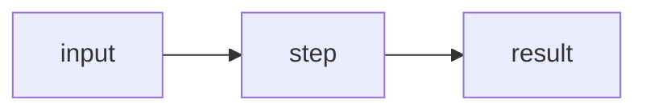

# Claude Cowork Handoff — LeetCode Notes Repo

## Context

I'm setting up a new GitHub repo for LeetCode practice + bilingual notes (中文 + English). I'm prepping for coding interviews and want this to (a) work as my personal review hub, and (b) eventually be useful to other people studying. Solutions in **Python, C++, and Java**.

Publishing target: **GitHub Pages via mkdocs-material**. Search-as-you-type across all my notes is the killer feature.

My workflow with you (Cowork):
1. I solve a problem on LeetCode.
2. I write rough notes, sometimes bilingual mid-sentence.
3. I send the rough notes to you to refine into the repo template.
4. You commit + push, site auto-deploys.

So you're doing both the **one-time setup** described below, and the **recurring per-problem refinement** described at the bottom.

---

## Step 1 — Repo skeleton

Create a new GitHub repo (ask me for the name and my handle before creating). Top-level structure:

```
<repo-name>/
├── docs/
│   ├── index.md                      # landing page + progress summary
│   ├── _template/
│   │   └── problem-template.md       # reference template
│   ├── 00-prelude/                   # 前序·打基础
│   ├── 01-array/                     # 数组
│   ├── 02-linked-list/               # 链表
│   ├── 03-hash-table/                # 哈希表
│   ├── 04-string/                    # 字符串
│   ├── 05-two-pointers/              # 双指针法
│   ├── 06-stack-queue/               # 栈与队列
│   ├── 07-binary-tree/               # 二叉树
│   ├── 08-backtracking/              # 回溯算法
│   ├── 09-greedy/                    # 贪心算法
│   ├── 10-dp/                        # 动态规划
│   ├── 11-monotonic-stack/           # 单调栈
│   └── 12-graph/                     # 图论
├── mkdocs.yml
├── requirements.txt
├── README.md                         # repo-facing readme (≠ docs/index.md)
├── LICENSE                           # MIT, "Yang Zheng", current year
├── .gitignore                        # site/, __pycache__/, .DS_Store, .venv/
└── .github/workflows/deploy.yml
```

Each category folder gets a stub `index.md` (bilingual title + empty problem table) and a `.pages` file for awesome-pages nav ordering.

Each problem lives at:

```
01-array/0001-two-sum/
├── README.md          # bilingual notes (the main artifact)
└── images/            # diagrams, GIFs (only if needed)
```

**Naming conventions:**
- Problem folders: `NNNN-kebab-case-title/` — always 4-digit zero-padded.
- Category folders: `NN-kebab-case/`.
- Notes file is always `README.md` inside the problem folder.

---

## Step 2 — mkdocs setup

`mkdocs.yml`:

```yaml
site_name: LeetCode Roadmap (刷题手记)
site_description: Bilingual LeetCode notes & solutions in Python, C++, Java
site_url: https://<github-username>.github.io/<repo-name>/
repo_url: https://github.com/<github-username>/<repo-name>
repo_name: <github-username>/<repo-name>

theme:
  name: material
  language: en
  features:
    - navigation.tabs
    - navigation.sections
    - navigation.indexes
    - navigation.top
    - search.suggest
    - search.highlight
    - content.code.copy
    - content.code.annotate
    - content.tabs.link
    - toc.follow
  palette:
    - scheme: default
      primary: indigo
      toggle: { icon: material/weather-night, name: Switch to dark mode }
    - scheme: slate
      primary: indigo
      toggle: { icon: material/weather-sunny, name: Switch to light mode }

plugins:
  - search:
      lang: [en, zh]
  - awesome-pages

markdown_extensions:
  - admonition
  - pymdownx.details
  - pymdownx.superfences:
      custom_fences:
        - name: mermaid
          class: mermaid
          format: !!python/name:pymdownx.superfences.fence_code_format
  - pymdownx.tabbed: { alternate_style: true }
  - pymdownx.highlight: { anchor_linenums: true }
  - pymdownx.inlinehilite
  - pymdownx.snippets
  - pymdownx.arithmatex: { generic: true }
  - attr_list
  - md_in_html
  - footnotes
  - tables

extra_javascript:
  - https://cdnjs.cloudflare.com/ajax/libs/mathjax/3.2.0/es5/tex-mml-chtml.js
```

`requirements.txt`:

```
mkdocs-material
mkdocs-awesome-pages-plugin
pymdown-extensions
```

`.github/workflows/deploy.yml`:

```yaml
name: Deploy mkdocs site
on:
  push:
    branches: [main]
  workflow_dispatch:

permissions:
  contents: write

jobs:
  deploy:
    runs-on: ubuntu-latest
    steps:
      - uses: actions/checkout@v4
      - uses: actions/setup-python@v5
        with:
          python-version: '3.11'
      - run: pip install -r requirements.txt
      - run: mkdocs gh-deploy --force
```

After the first push, remind me to go to **Settings → Pages** and set source to the `gh-pages` branch.

---

## Step 3 — Problem note template

Save as `docs/_template/problem-template.md`. Every new problem starts as a copy of this:

````markdown
# NNNN. Title (English) / 中文标题

!!! info "Meta"
    - **Difficulty**: Easy/Medium/Hard · 简单/中等/困难
    - **Tags**: Array, Hash Table · 数组, 哈希表
    - **Link**: [LeetCode](https://leetcode.com/problems/...) · [力扣](https://leetcode.cn/problems/...)
    - **Status**: ✅ Solved · 已通过
    - **First solved**: YYYY-MM-DD
    - **Reviewed**: ☐ ☐ ☐

## Problem / 题意

**EN**: Paraphrase in my own words. Do NOT copy LeetCode's wording — link only.

**中文**: 用自己的话简述题意，不要复制原题面。

## Approach / 思路

**EN**: Key insight, invariant, why this works.

**中文**: 关键思路、不变量、为什么可行。

### Visual / 图解



## Solution / 题解

=== "Python"
    ```python
    class Solution:
        def method(self, ...):
            ...
    ```

=== "C++"
    ```cpp
    class Solution {
    public:
        ... method(...) {
            ...
        }
    };
    ```

=== "Java"
    ```java
    class Solution {
        public ... method(...) {
            ...
        }
    }
    ```

## Complexity / 复杂度

- **Time**: O(?)
- **Space**: O(?)

## Pitfalls / 易错点

- ...

## Related / 相关题目

- [NNNN. Title](../NNNN-slug/)
````

---

## Step 4 — Landing & category index pages

`docs/index.md` should have:
- Bilingual intro (~3 sentences each language).
- A summary table: total problems solved, broken down by category and difficulty.
- Link grid to all 13 categories.

Each `docs/NN-category/index.md` should have a problem table:

```markdown
# 数组 / Array

| #    | Title                  | Difficulty | Status | Reviewed |
|------|------------------------|------------|--------|----------|
| 0001 | [Two Sum](./0001-two-sum/) | Easy | ✅ | ☐ |
```

I'll maintain these tables manually for now (don't build a CI script for auto-generation yet — keep it simple).

---

## Step 5 — Initial commits

1. **Skeleton**: all 13 category folders with stub `index.md` and `.pages` for nav order, plus `_template/problem-template.md`.
2. **Config**: `mkdocs.yml`, `requirements.txt`, `LICENSE` (MIT, Yang Zheng, current year), `.gitignore`, repo-level `README.md`.
3. **CI**: `.github/workflows/deploy.yml`.
4. **One real example**: pick a simple problem (Two Sum is fine, or ask me) and fill in `01-array/0001-two-sum/README.md` completely so the template is concrete and the site has something to render.

After the first push, walk me through enabling GitHub Pages.

---

## Recurring workflow — what to do each time I send rough notes

When I paste rough notes for a new problem:

1. Identify category from the topic; create `NN-category/NNNN-slug/` if it doesn't exist.
2. Copy the template into a new `README.md` and fill in the bilingual sections from my notes.
3. **Preserve my voice** — I write casually, sometimes bilingual mid-sentence. Don't make it formal. Tighten and clarify, don't rewrite.
4. **Never copy LeetCode's problem statement verbatim.** Paraphrase or link only.
5. Format Python/C++/Java solutions consistently inside the tabbed code block. If I only sent one language, **ask** whether to translate to the others or leave them for later — don't auto-translate without asking.
6. If the problem benefits from a diagram, suggest one. Preference order for size/maintainability: **Mermaid > SVG > Excalidraw export > GIF**. Only add visuals when they actually help.
7. Update the parent category's `index.md` table and the main `docs/index.md` counts.
8. Commit message format: `feat(NNNN): add <title>` for new, `docs(NNNN): refine notes` for revisions.

---

## Constraints

- **Tone**: casual, terse, sometimes bilingual mid-sentence. Don't formalize it.
- **Conciseness**: code > prose where possible. No filler.
- **License**: MIT, in my name.
- **Copyright safety**: zero verbatim LeetCode problem text. Paraphrase + link only.
- **No premature automation**: keep tables/counts manual until I ask for a script.

---

## Confirm before starting

1. Repo name? (suggestion: `leetcode-notes` or `leetcode-roadmap`)
2. My GitHub handle for the repo URL and LICENSE?
3. Should the seeded example problem be Two Sum, or something I've already solved?
