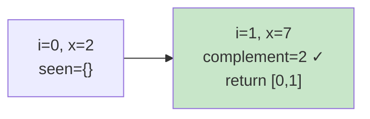

# 0001. Two Sum / 两数之和

!!! info "Meta"
    - **Difficulty**: Easy
    - **Tags**: Array, Hash Table · 数组, 哈希表
    - **Link**: [LeetCode](https://leetcode.com/problems/two-sum/) · [力扣](https://leetcode.cn/problems/two-sum/)
    - **Status**: ✅ Solved
    - **First solved**: 2026-05-04
    - **Reviewed**: ☐ ☐ ☐

## Problem / 题意

**EN**: Given an integer array and a target, return the indices of the two numbers that add up to the target. Exactly one pair exists, and you can't reuse an element.

**中文**: 给一个整数数组和一个目标值，返回两个数的下标使它们之和等于 target。题目保证有且仅有一组解，同一个元素不能用两次。

## Approach / 思路

**EN**: Brute force is O(n²). Better: walk the array once, and for each `x` ask "have I already seen `target - x`?" — that's O(1) lookup with a hash map. Store `value → index` as you go so the answer is just `[seen[complement], i]`.

**中文**: 暴力解 O(n²)。更好的做法：边遍历边把已见过的数存进哈希表 (`value → index`)，对当前 `x` 直接查 `target - x` 在不在表里。哈希查找 O(1)，整体一次遍历搞定。

Key invariant / 关键不变量: 当扫到 `i` 时，`seen` 里只放下标 `< i` 的元素，所以查到的 `complement` 永远是个**之前**的位置 → 不会用同一个元素两次。

### Visual / 图解



`nums = [2, 7, 11, 15], target = 9` → 第二步就命中。

## Solution / 题解

=== "Python"
    ```python
    class Solution:
        def twoSum(self, nums: list[int], target: int) -> list[int]:
            seen: dict[int, int] = {}
            for i, x in enumerate(nums):
                if (c := target - x) in seen:
                    return [seen[c], i]
                seen[x] = i
            return []
    ```

=== "C++"
    ```cpp
    class Solution {
    public:
        vector<int> twoSum(vector<int>& nums, int target) {
            unordered_map<int, int> seen;
            for (int i = 0; i < (int)nums.size(); ++i) {
                int c = target - nums[i];
                auto it = seen.find(c);
                if (it != seen.end()) return {it->second, i};
                seen[nums[i]] = i;
            }
            return {};
        }
    };
    ```

=== "Java"
    ```java
    class Solution {
        public int[] twoSum(int[] nums, int target) {
            Map<Integer, Integer> seen = new HashMap<>();
            for (int i = 0; i < nums.length; i++) {
                int c = target - nums[i];
                if (seen.containsKey(c)) return new int[]{seen.get(c), i};
                seen.put(nums[i], i);
            }
            return new int[0];
        }
    }
    ```

## Complexity / 复杂度

- **Time**: O(n) — one pass, O(1) hash ops amortized.
- **Space**: O(n) — hash map at worst holds all elements.

## Pitfalls / 易错点

- 先查 `complement` **再**写入 `seen` —— 顺序反了会用同一个下标两次（比如 `nums=[3,3], target=6`，反过来就直接返回 `[0,0]`）。
- C++ 用 `unordered_map`，别用 `map`（O(log n)）。
- 题目保证恰好一解，所以最后的 `return []` 只是占位 / safety net，正常不会走到。

## Related / 相关题目

- 0015. 3Sum (待补)
- 0167. Two Sum II - Input Array Is Sorted (待补) — 双指针法版本
- 0653. Two Sum IV - Input is a BST (待补)
