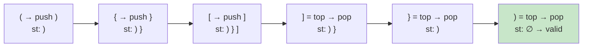

# 0020. Valid Parentheses / 有效的括号

!!! info "Meta"
    - **Difficulty**: Easy
    - **Tags**: Stack, String · 栈, 字符串
    - **Link**: [LeetCode](https://leetcode.com/problems/valid-parentheses/) · [力扣](https://leetcode.cn/problems/valid-parentheses/)
    - **Status**: ✅ Solved
    - **First solved**: 2026-05-04
    - **Reviewed**: ☐ ☐ ☐

## Problem / 题意

**EN**: Given a string of `()`, `{}`, `[]`, decide if every opener is closed in the correct nesting order.

**中文**: 给一串只包含 `()`, `{}`, `[]` 的字符串，判断括号是否成对、嵌套是否正确。

## Approach / 思路

**EN**: 三种 invalid 情况要 cover：
1. 左括号多余（最后栈里还剩东西）
2. 右括号多余（碰到右括号但栈是空的）
3. 配对错误（右括号 ≠ 栈顶）

**Trick**: 看到左括号就 push 对应的**右括号**进栈 —— 这样遇到真的右括号时，直接和 `st.top()` 比就行，不需要再写 `(` ↔ `)`、`{` ↔ `}`、`[` ↔ `]` 三组分支。

**EN summary**: Push the *expected closer* on every opener. On a closer, just compare to `st.top()`. Match → pop. Mismatch or empty stack → instantly invalid.

**Early exit**: 字符串长度是奇数直接 return false，不可能配平。

Key invariant / 关键不变量: 栈里始终保存"目前还需要等什么右括号才能闭合"，按出现顺序排列。

### Visual / 图解

Trace `"({[]})"`:



如果中间任何一步遇到 `]` 而 `st.top() == }`，立即 false。

## Solution / 题解

=== "Python"
    ```python
    class Solution:
        def isValid(self, s: str) -> bool:
            if len(s) % 2:
                return False
            pair = {'(': ')', '{': '}', '[': ']'}
            st: list[str] = []
            for c in s:
                if c in pair:
                    st.append(pair[c])
                elif not st or st[-1] != c:
                    return False
                else:
                    st.pop()
            return not st
    ```

=== "C++"
    ```cpp
    class Solution {
    public:
        bool isValid(string s) {
            if (s.size() % 2 != 0) return false;  // 奇数肯定不 valid
            stack<char> st;
            for (char c : s) {
                if      (c == '(') st.push(')');
                else if (c == '{') st.push('}');
                else if (c == '[') st.push(']');
                // 右括号但栈空 → 多余的右括号
                // 右括号但 ≠ 栈顶 → 不匹配
                else if (st.empty() || c != st.top()) return false;
                else st.pop();  // 匹配上了
            }
            return st.empty();  // 还剩东西 → 多余的左括号
        }
    };
    ```

=== "Java"
    ```java
    // TBD
    ```

## Complexity / 复杂度

- **Time**: O(n).
- **Space**: O(n) — 最坏情况全是左括号，全压栈。

## Pitfalls / 易错点

- 顺序：先判 `st.empty()` 再判 `c != st.top()` —— 反过来对空栈调 `top()` 会 UB（C++）/ IndexError（Python）。`||` 短路救了你，但写法本身要清楚。
- 别忘了最后 `return st.empty()` —— 全程没匹配错也可能是左括号有剩，比如 `"(("`。
- 奇数长度的早退是 micro-opt，不写也对，但能省一遍循环。
- "push 对应右括号"这个 trick 比"push 左括号、close 时映射回去"代码短一半，建议固化成肌肉记忆。

## Related / 相关题目

- [0225. Implement Stack using Queues](../0225-implement-stack-using-queues/README.md) — 栈的基本设计
- 1047. Remove All Adjacent Duplicates In String (待补) — 同样是"配对消除"模式
- 0150. Evaluate Reverse Polish Notation (待补) — 栈处理表达式
