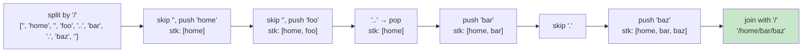

# 0071. Simplify Path / 简化路径

!!! info "Meta"
    - **Difficulty**: Medium
    - **Tags**: Stack, String · 栈, 字符串
    - **Link**: [LeetCode](https://leetcode.com/problems/simplify-path/)
    - **Status**: ✅ Solved
    - **First solved**: 2026-05-04
    - **Reviewed**: ☐ ☐ ☐

## Problem / 题意

**EN**: Given a Unix-style absolute path, return its canonical form. Treat `.` as "current dir", `..` as "go up one", `//` as a single `/`, and the result must start with `/` and have no trailing `/` (except the root itself).

**中文**: 给一个 Unix 风格的绝对路径, 返回它的规范形式. `.` 是当前目录, `..` 是回上一级, `//` 折叠成一个 `/`, 结果以 `/` 开头, 末尾不能多 `/` (根目录除外).

## Approach / 思路

### 核心思想 / Core idea

**用栈模拟目录跳转**: 按 `/` 切成段, 遇到 `..` 就 pop, 遇到普通目录名就 push. 栈里剩下的从底到顶就是规范路径.

栈的 LIFO 特性天然契合"返回上一级"的语义 —— 这是这题选栈的根本原因.

### 关键洞察 / Key insights

1. **字符串处理两步走: 切分 + 处理 / Split then walk**

    字符串题的经典套路: 先把原字符串按分隔符切成 token, 再逐段处理. **切分阶段不要混业务逻辑, 处理阶段不要再操心边界字符** —— 分离职责, 代码立刻清楚.

2. **用 `vector` 当栈, 方便最后拼接 / Use `vector` not `std::stack`**

    最后要把栈内所有元素从底到顶拼起来 —— `std::stack` 不能遍历 (只能 `top()` / `pop()`), 所以这题直接用 `vector<string>` 当栈, 既有 push/pop, 又能 range-for 遍历.

### 可迁移思路 / Transferable thinking

**栈 = 模拟"可撤销操作"的天然结构.** 题目里只要有"返回 / 撤销 / 上一级 / 抵消 / 嵌套"语义, 先想栈:

| 题目 | 栈用来"撤销"什么 |
|---|---|
| **0071 路径简化** (本题) | `..` 撤销上一级目录 |
| **[0020 有效括号](../0020-valid-parentheses/README.md)** | 右括号撤销最近的左括号 |
| **0394 字符串解码** (待补) | `]` 撤销并展开最近的 `[` |
| **[1047 删除相邻重复项](../1047-remove-all-adjacent-duplicates-in-string/README.md)** | 相同字符互相抵消 |
| **0844 比较退格字符串** (待补) | `#` 撤销前一个字符 |
| **0224 / 0227 表达式求值** (待补) | 括号 / 优先级 |
| **0856 括号分数** (待补) | 嵌套结构求值 |

这一类统称**栈模拟题**, 思路完全一样: **遍历输入, 根据当前元素决定 push 还是 pop, 最后栈内剩下的就是答案**.

**字符串处理通用模板**: `split → 遍历每段处理 → join`. LC 0071 / 0468 (有效IP) / 0165 (版本号比较) 都套这个壳.

### 一句话总结 / One-liner

**看到"路径 / 撤销 / 嵌套 / 抵消"语义 → 用栈; 切字符串 → C++ 用 `istringstream + getline`, Python/JS 直接 `split`; 要遍历栈内容 → 用 `vector` 当栈.**

## C++ 关键语法 / C++ syntax notes

### `istringstream` + `getline` —— 字符串分割

C++ 没有 `string.split()`, 标配做法:

```cpp
#include <sstream>
istringstream ss(path);     // 把字符串包装成输入流
string tok;
while (getline(ss, tok, '/')) {
    // 每次 tok 是按 '/' 切出的一段
}
```

记忆要点:

- `istringstream` = **i**nput **s**tring **stream**, 从字符串读.
- `getline(stream, output, delim)` 三参数版: 按指定分隔符切.
- 多个连续分隔符会切出**空串** —— 别忘 `if (tok == "") continue;`
- `.` 也会被切出来, 要主动跳过.

### `vector` 当栈 vs `std::stack`

```cpp
vector<string> stk;
stk.push_back(tok);    // 入栈
stk.back();            // 看栈顶
stk.pop_back();        // 弹栈顶 (void, 不返回值)
stk.empty();           // 判空
for (const string& s : stk) ...  // ✅ 可遍历
```

对比 `std::stack`: API 是 `push` / `top` / `pop`, 但**不能遍历** —— 这题最后要拼字符串, 所以选 `vector`.

## Visual / 图解

Trace `"/home//foo/../bar/./baz/"`:



## Solution / 题解

=== "C++"
    ```cpp
    class Solution {
    public:
        string simplifyPath(string path) {
            vector<string> stk;
            istringstream ss(path);
            string tok;

            while (getline(ss, tok, '/')) {
                if (tok == "" || tok == ".") continue;
                if (tok == "..") {
                    // 根目录的上一级还是根 —— 必须先判空再 pop
                    if (!stk.empty()) stk.pop_back();
                } else {
                    stk.push_back(tok);
                }
            }

            string res;
            for (const string& s : stk) res += "/" + s;
            return res.empty() ? "/" : res;
        }
    };
    ```

=== "Python"
    ```python
    class Solution:
        def simplifyPath(self, path: str) -> str:
            # str.split(sep): 把字符串按 sep 切成 list[str]. 等价于 C++ 的
            # istringstream + getline 那一坨, 一行搞定. 连续 '/' 会切出 ''
            # (跟 C++ 行为一致), 所以下面也得跳过空串.
            #   C++ 等价: istringstream ss(path); string tok;
            #            while (getline(ss, tok, '/')) {...}
            parts = path.split('/')

            stack: list[str] = []
            for p in parts:
                if p == '' or p == '.':
                    continue
                if p == '..':
                    # list.pop() 默认弹最后一个 (LIFO), 等价 C++ vector.pop_back().
                    # 用 list 当栈是 Python 的标配 —— 没有专门的 stack 类型.
                    if stack:
                        stack.pop()
                else:
                    stack.append(p)  # 等价 vector.push_back

            # '/'.join(iterable): 用 '/' 把 iterable 里的字符串拼起来.
            # 等价于 C++ 里手写的 for 循环 res += "/" + s, 但更简洁.
            # 注意: stack 为空时 '/'.join([]) == '' → '/' + '' == '/' (根),
            # 所以不需要 C++ 的三元判空, 这一行同时处理了根目录情况.
            return '/' + '/'.join(stack)
    ```

=== "JavaScript"
    ```javascript
    /**
     * @param {string} path
     * @return {string}
     */
    var simplifyPath = function(path) {
        // String.prototype.split(sep): 跟 Python 的 split 一样, 返回 array.
        // 连续 '/' 会切出 '', 跟 C++ / Python 行为一致.
        //   C++ 等价: istringstream + getline 循环.
        const parts = path.split('/');

        // 普通数组就是栈 —— push 到末尾, pop 拿末尾. 跟 C++ vector / Python list 思路相同,
        // JS 没有专门的 stack 类型, 数组就够用.
        const stack = [];

        for (const p of parts) {
            // for...of 遍历 iterable 的值 (不是 index), 类似 C++ range-for.
            // for...in 是遍历 key/index, 容易踩坑别用错.
            if (p === '' || p === '.') continue;
            if (p === '..') {
                // arr.length 取数组长度; 判空写 length > 0 或 stack.length 都行,
                // !stack 不行 —— 空数组在 JS 里是 truthy! 这是 JS 特有的坑.
                if (stack.length > 0) stack.pop();
            } else {
                stack.push(p);
            }
        }

        // Array.prototype.join(sep): 把数组所有元素用 sep 连起来.
        // 等价 Python 的 '/'.join(stack), C++ 里要手写 for 循环.
        // 空数组 → '' → '/' + '' == '/' (根目录), 同样不用单独处理.
        return '/' + stack.join('/');
    };
    ```

## Complexity / 复杂度

- **Time**: O(n) — 字符串扫一遍.
- **Space**: O(n) — 栈最坏存所有段.

## Pitfalls / 易错点

1. **空串要跳过** —— `//` 之间会切出空 token.
2. **`.` 要跳过** —— 表示当前目录, 不入栈.
3. **`..` 要先判空** —— 根目录的上一级还是根目录, 不能盲目 pop.
4. **栈空时返回 `"/"`** —— 别返回空字符串. 上面 Python/JS 用 `'/' + join` 同时处理了; C++ 三元判空也行.
5. **结果末尾不要有 `/`** —— `'/' + stack.join('/')` 拼法刚好不会留尾斜杠 (除非根目录, 但根目录就是 `/`, OK).
6. **JS 判空数组别用 `!stack`** —— 空数组 `[]` 在 JS 里是 truthy, 必须 `stack.length > 0` 或 `stack.length === 0`.
7. **C++ 中 `getline(ss, tok, '/')` 处理首字符 `/`** —— path 一定以 `/` 开头, 第一个 token 就是空串, 自然被 `if (tok == "")` 跳过. 不用特判.

## Related / 相关题目

- [0020. Valid Parentheses / 有效的括号](../0020-valid-parentheses/README.md) — 同款"撤销最近的"
- [1047. Remove All Adjacent Duplicates In String / 删除字符串中的所有相邻重复项](../1047-remove-all-adjacent-duplicates-in-string/README.md) — 抵消模式
- [0155. Min Stack / 最小栈](../0155-min-stack/README.md) — 栈 + 缓存信息
- 0394. Decode String (待补) — 嵌套结构展开, 双栈
- 0844. Backspace String Compare (待补) — `#` 当撤销操作
