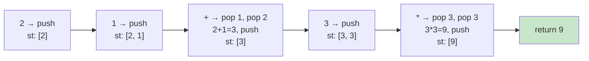

# 0150. Evaluate Reverse Polish Notation / 逆波兰表达式求值

!!! info "Meta"
    - **Difficulty**: Medium
    - **Tags**: Stack, Math, Array · 栈, 数学, 数组
    - **Link**: [LeetCode](https://leetcode.com/problems/evaluate-reverse-polish-notation/) · [力扣](https://leetcode.cn/problems/evaluate-reverse-polish-notation/)
    - **Status**: ✅ Solved
    - **First solved**: 2026-05-04
    - **Reviewed**: ☐ ☐ ☐

## Problem / 题意

**EN**: Given tokens of an expression in Reverse Polish Notation (operands then operator, e.g. `["2","1","+","3","*"]` = `(2+1)*3`), evaluate and return the integer result. Division truncates toward zero.

**中文**: 给一个逆波兰表达式（运算数在前、运算符在后，如 `["2","1","+","3","*"]` 表示 `(2+1)*3`），算出整数结果。除法向 0 截断。

## Approach / 思路

**EN**: One stack scan:
- 遇到数字 → push.
- 遇到运算符 → 连续 pop 两次拿 `num1` (后弹的右操作数) 和 `num2` (先弹的左操作数), 算 `num2 op num1`, push 结果回去.
- 扫完后栈里只剩一个数, 就是答案.

**中文**: 一遍扫栈搞定 —— 数字入栈, 运算符弹两个算完再压回去.

### Summary / 套路总结

EN: This is **why RPN exists** — operators only ever consume their two immediate operands, which are conveniently the top two stack entries. No precedence rules, no parentheses, no parser. Compilers and calculators (HP) lean on this for the same reason.

中文小结: RPN 的精髓 = 运算符只关心栈顶两个操作数, 不用解析优先级, 没有括号开销. 编译器和老惠普计算器都用这套.

Key invariant / 关键不变量: 任何时刻栈里只有"已计算但还没被消费的中间结果". 表达式合法时, 扫完恰好剩一个.

### Visual / 图解

Trace `["2","1","+","3","*"]`:



## Solution / 题解

=== "Python"
    ```python
    class Solution:
        def evalRPN(self, tokens: list[str]) -> int:
            st: list[int] = []
            for t in tokens:
                if t in {'+', '-', '*', '/'}:
                    b = st.pop()                # 右操作数 (后弹的)
                    a = st.pop()                # 左操作数 (先弹的)
                    if   t == '+': st.append(a + b)
                    elif t == '-': st.append(a - b)
                    elif t == '*': st.append(a * b)
                    else:          st.append(int(a / b))   # truncate toward 0
                else:
                    st.append(int(t))
            return st[-1]
    ```

=== "C++"
    ```cpp
    class Solution {
    public:
        int evalRPN(vector<string>& tokens) {
            stack<long long> st;  // long long 防溢出
            // number: push to stack
            // operator: pop top 2 numbers, calc, push result back
            // note: num2 (first pop) is the LEFT operand, num1 is the RIGHT
            // wait — in your code: num1 = first pop = RIGHT, num2 = second pop = LEFT.
            // So compute num2 op num1.
            for (const string& s : tokens) {
                if (s == "+" || s == "-" || s == "*" || s == "/") {
                    long long num1 = st.top(); st.pop();   // right
                    long long num2 = st.top(); st.pop();   // left
                    long long res = 0;
                    if      (s == "+") res = num2 + num1;
                    else if (s == "-") res = num2 - num1;
                    else if (s == "*") res = num2 * num1;
                    else               res = num2 / num1;  // C++ / 自动向 0 截断
                    st.push(res);
                } else {
                    st.push(stoll(s));
                }
            }
            return (int)st.top();
        }
    };
    ```

=== "Java"
    ```java
    // TBD
    ```

## Complexity / 复杂度

- **Time**: O(n) — each token visited once.
- **Space**: O(n) — stack holds up to ~n/2 numbers (all-numbers prefix).

## Pitfalls / 易错点

- **操作数顺序**: 先 pop 出来的是**右**操作数 (`num1`), 后 pop 出来的才是**左** (`num2`). 所以是 `num2 - num1`, `num2 / num1`. `+` `*` 顺序无所谓, `-` `/` 错了立刻 WA.
- **Python 除法截断**: 不要用 `a // b` —— 那是 floor division, 负数会朝 -∞ 走 (`-7 // 2 == -4`). 题目要求向 0 截断, 必须 `int(a / b)` (`int(-7 / 2) == -3`). C++ 的 `/` 对整型默认就是向 0 截断, 不用特殊处理.
- **溢出**: LeetCode 数据范围里中间结果可能超 `int`. 用 `long long` (C++) 或 Python 原生大整数稳一点. 最后再转回 `int` 返回.
- **token 自带正负号**: 像 `"-11"` 直接 `stoll` / `int()` 都能解析, 不用手写符号判断.
- **C++ `stack::pop()` 不返回值**: 必须先 `top()` 拿值再 `pop()` —— 同 0020/1047, 老朋友了.

## Related / 相关题目

- [0020. Valid Parentheses / 有效的括号](../0020-valid-parentheses/README.md) — 栈处理符号匹配
- [1047. Remove All Adjacent Duplicates In String / 删除字符串中的所有相邻重复项](../1047-remove-all-adjacent-duplicates-in-string/README.md) — 同样的"扫一遍栈"模式
- 0224. Basic Calculator (待补) — 中缀表达式带括号, 难度上一档
- 0227. Basic Calculator II (待补) — 中缀 + 优先级, 不带括号
