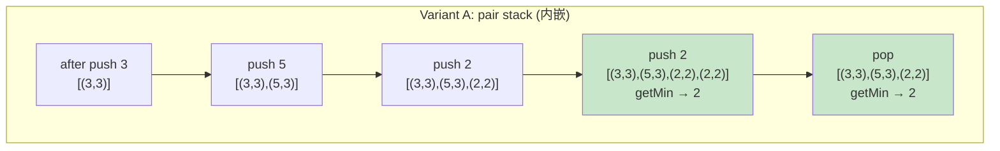

# 0155. Min Stack / 最小栈

!!! info "Meta"
    - **Difficulty**: Medium
    - **Tags**: Stack, Design · 栈, 设计
    - **Link**: [LeetCode](https://leetcode.com/problems/min-stack/)
    - **Status**: ✅ Solved
    - **Reviewed**: ☐ ☐ ☐

## Problem

**EN**: Design a stack that supports `push` / `pop` / `top` / `getMin`, all in **O(1)**. The catch is `getMin` —— a vanilla stack would have to scan to find the minimum.

**中文**: 设计一个支持 `push` / `pop` / `top` / `getMin` 的栈, 全部 O(1). 难点在 `getMin` —— 普通栈查最小要 O(n).

## 思路

### Core idea

**空间换时间**: push 时把"那一刻的最小值"提前算好缓存起来, getMin 直接读 → O(1). 普通栈是"按需计算", 这里改成"提前缓存".

**EN**: Trade space for time — pre-compute and cache "the min as of right now" on every push, so `getMin` just reads it.

### Key Insights

1. **栈的"历史快照"特性 / Stack's historical-snapshot property**

    栈是 LIFO —— pop 后栈顶**自动恢复**到之前的状态. 所以只要每次 push 时把"当时的最小值"绑在节点上, pop 之后栈顶节点天然持有"那时的最小值", 不用重新遍历计算历史最小.

    *这是栈独有的优势*. 队列做不到 —— 因为 pop 的是另一端, 状态不会回滚.

2. **辅助信息可以"塞进节点"也可以"另起一栈" / Cache inline or in a side stack**

    两种等价实现:

    - 节点内嵌: `stack<pair<value, minSoFar>>` (最简单, Yang 的提交版本)
    - 双栈分离: 主栈 + 辅助栈
    - 双栈优化: 辅助栈**只在最小值真的变小**时才 push, 省点空间

    选哪个看代码风格 + 是否需要节省空间. Big-O 都一样.

3. **辅助栈天然单调非增 / The aux stack is implicitly monotonic**

    优化版的辅助栈, 元素从底到顶是**单调非增**的 (相等可以保留, 后面会解释为什么必须保留). 这就接上了**单调栈**思想 —— 最小栈的优化版本本质上就是个为这道题量身定制的单调栈.

### 可迁移思路

这道题的招式叫 **"在每个状态点缓存一个聚合信息, 把查询拍平到 O(1)"**, 在很多题里都能套:

- **0716. Max Stack** —— 一模一样, min 换成 max, 或同时维护两个.
- **[0232. Implement Queue using Stacks](../0232-implement-queue-using-stacks/README.md)** —— 也是双栈, 把"反向访问"的信息缓存在另一个栈里.
- **[0225. Implement Stack using Queues](../0225-implement-stack-using-queues/README.md)** —— 对偶问题, 双结构思想.
- **0496 / 0739 单调栈系列** —— "压栈时维护单调性 + 缓存信息", 跟最小栈优化版是亲戚.
- **前缀和 / 前缀最值** —— 数组版同款思想: `prefMin[i]` 缓存 `[0..i]` 的最小值, 查询 O(1). 最小栈是"动态前缀最值".
- **[0239. Sliding Window Maximum](../0239-sliding-window-maximum/README.md)** —— 进阶: 窗口两端都在变, 升级成单调队列. 最小栈是"只 push/pop 一端"的简化版.
- **稀疏表 / 并查集 size / Trie 计数** —— 本质都是这个骨架: 在写入时顺手维护聚合信息.

### 一句话总结

**EN**: 看到 "O(1) 查询某种聚合值"(min / max / sum / count / ...), 先想能不能在 push/insert 时**顺手把答案算好存起来** —— 这是空间换时间最朴素的形态.

### 图解

Trace `push 3, 5, 2, 2, getMin, pop, getMin`:



双栈优化版同样的输入, 辅助栈只在"小于等于"时 push:

| op | main | aux (optimized) | getMin |
|---|---|---|---|
| push 3 | `[3]` | `[3]` | — |
| push 5 | `[3,5]` | `[3]` (5 > 3, skip) | — |
| push 2 | `[3,5,2]` | `[3,2]` (2 < 3, push) | — |
| push 2 | `[3,5,2,2]` | `[3,2,2]` (2 == top, **必须 push**) | 2 |
| pop  | `[3,5,2]` | `[3,2]` (popped 2 == aux.top, pop aux) | 2 |

注意 push 第二个 2 时**必须**也压进辅助栈 —— 否则之后 pop 一个 2, 辅助栈也跟着 pop, 就把"原来那个 2 时的最小值"也丢了. 后面 Pitfalls 里展开.

## Solution

### Variant A — pair stack (内嵌, Yang 的提交版本)

最直接: 每个节点装 `(value, min_so_far)`. 代码最短, 内存稍微多一点 (每个 push 都存一份 min).

=== "Python"
    ```python
    class MinStack:
        def __init__(self):
            self.st: list[tuple[int, int]] = []   # (val, min_so_far)

        def push(self, val: int) -> None:
            cur_min = val if not self.st else min(val, self.st[-1][1])
            self.st.append((val, cur_min))

        def pop(self) -> None:
            self.st.pop()

        def top(self) -> int:
            return self.st[-1][0]

        def getMin(self) -> int:
            return self.st[-1][1]
    ```

=== "C++"
    ```cpp
    class MinStack {
    public:
        // {值, 当前最小值}
        stack<pair<int, int>> st;
        MinStack() {}

        void push(int val) {
            int curMin = st.empty() ? val : min(val, st.top().second);
            st.push({val, curMin});
        }
        void pop()       { st.pop(); }
        int  top()       { return st.top().first; }
        int  getMin()    { return st.top().second; }
    };
    ```

=== "Java"
    ```java
    // TBD
    ```

### Variant B — two stacks, aux pushed every time (双栈基础版)

逻辑等价于 Variant A, 把 `min_so_far` 拆到独立的辅助栈. 主栈和辅助栈始终同步 push/pop.

=== "Python"
    ```python
    class MinStack:
        def __init__(self):
            self.st: list[int] = []
            self.aux: list[int] = []   # min as of each push

        def push(self, val: int) -> None:
            self.st.append(val)
            self.aux.append(val if not self.aux else min(val, self.aux[-1]))

        def pop(self) -> None:
            self.st.pop()
            self.aux.pop()

        def top(self) -> int:
            return self.st[-1]

        def getMin(self) -> int:
            return self.aux[-1]
    ```

### Variant C — two stacks, aux only on new min (双栈优化, 单调栈思想)

辅助栈只在"新最小值出现"时 push, pop 时只在"主栈弹的值 == 辅助栈顶"时 pop 辅助栈. 节省空间, 但要小心 `<=` / `==` 那两个细节 (见 Pitfalls).

=== "Python"
    ```python
    class MinStack:
        def __init__(self):
            self.st: list[int] = []
            self.aux: list[int] = []

        def push(self, val: int) -> None:
            self.st.append(val)
            # 注意: <= 不是 < —— 重复的最小值也得记
            if not self.aux or val <= self.aux[-1]:
                self.aux.append(val)

        def pop(self) -> None:
            v = self.st.pop()
            if v == self.aux[-1]:
                self.aux.pop()

        def top(self) -> int:
            return self.st[-1]

        def getMin(self) -> int:
            return self.aux[-1]
    ```

=== "C++"
    ```cpp
    class MinStack {
        stack<int> st;
        stack<int> aux;
    public:
        void push(int val) {
            st.push(val);
            if (aux.empty() || val <= aux.top()) aux.push(val);  // <= 不是 <
        }
        void pop() {
            int v = st.top(); st.pop();
            if (v == aux.top()) aux.pop();
        }
        int top()    { return st.top(); }
        int getMin() { return aux.top(); }
    };
    ```

## Complexity

All variants:

- **Time**: `push` / `pop` / `top` / `getMin` 全部 **O(1)**.
- **Space**: O(n) for Variant A and B (每个 push 都缓存一份 min). Variant C 最坏 O(n), 平均更省 (输入越"乱"省得越多).

## 易错点

1. **优化版 push 用 `<=` 不是 `<`** —— 否则**重复的最小值**只会进辅助栈一次, 之后多次 pop 那个值会让辅助栈过早弹空. 例: `push 2, push 2, pop, getMin` —— 没 `<=` 的话辅助栈只有一个 2, 第一次 pop 把它弹掉, getMin 就崩了.
2. **优化版 pop 用 `==` 不是 `<` 或 `<=`** —— 我们要做的是"如果弹出去的恰好是当前最小, 顺手把辅助栈也弹一个". 写成 `<` 或 `<=` 会要么少弹要么多弹, 都不对.
3. **空栈的 `getMin()`** —— 题目通常保证不会调空栈, 但工程代码要么抛异常要么返回 sentinel. 看 spec.
4. **Variant A 的内存**: 每个 push 都存一份 min, 哪怕 min 没变. 如果数据极端 (所有元素都比初始最小大), Variant C 能省一半多内存.
5. **`top()` 别返回 `getMin()`** —— 听起来傻, 但写双栈时手快真容易写错. 主栈顶才是 `top`, 辅助栈顶才是 `getMin`.

## 相关题目

- [0225. Implement Stack using Queues / 用队列实现栈](../0225-implement-stack-using-queues/README.md) — 双结构互相模拟
- [0232. Implement Queue using Stacks / 用栈实现队列](../0232-implement-queue-using-stacks/README.md) — 双栈思想的另一种用法
- [0239. Sliding Window Maximum / 滑动窗口最大值](../0239-sliding-window-maximum/README.md) — 双端窗口的"动态最值", 单调栈/队列的进阶
- 0716. Max Stack (待补) — 同一套路, min ↔ max
- 0496. Next Greater Element I (待补) — 单调栈入门
- 0739. Daily Temperatures (待补) — 单调栈经典
