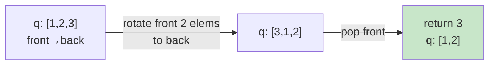

# 0225. Implement Stack using Queues / 用队列实现栈

!!! info "Meta"
    - **Difficulty**: Easy
    - **Tags**: Stack, Queue, Design · 栈, 队列, 设计
    - **Link**: [LeetCode](https://leetcode.com/problems/implement-stack-using-queues/)
    - **Status**: ✅ Solved
    - **Reviewed**: ☑ ☐ ☐

## Problem

**EN**: Build a LIFO stack (`push` / `pop` / `top` / `empty`) using only standard FIFO queue ops (push to back, pop from front, peek front, size, empty).

**中文**: 只用 FIFO 队列的标准操作实现一个 LIFO 栈，要支持 `push` / `pop` / `top` / `empty`。

## 思路

### Two queues — q2 做备份 / 双队列

**EN**: `q1` holds the data, `q2` is scratch.
- `push`: 直接 push 到 q1.
- `pop`: 把 q1 的前 `size-1` 个搬到 q2，q1 剩下的最后那个就是 last-pushed → 那就是栈顶。pop it as `res`，然后把 q2 整体当作新的 q1，清空 q2。
- `top`: 复用 `pop()`，拿到 res 后再 push 回去。
- `empty`: 直接 q1.empty().

**中文**: 思路就是两个队列轮换 —— q1 装数据，q2 做暂存。pop 的时候把 q1 前面 n-1 个挪到 q2，剩下那个就是后入的（也就是栈顶）。

### Optimized: one queue / 一个队列就够

**EN**: 不需要 q2。pop 的时候，把队头前 `size-1` 个元素重新 push 到队尾 —— 队列首尾相连转一圈，原本"最后入队"的就跑到队头了，直接 pop 即可。

**中文**: 用一个队列模拟栈，pop 时把队头 `size-1` 个元素依次 push 到队尾就行。一圈下来栈顶自然到队头。

Key invariant / 关键不变量: 一次 push 只是入队；一次 pop 在弹出前把"老数据"轮转到尾巴，让"最新数据"暴露在队头。

### 图解

One-queue rotation, after `push 1,2,3` then `pop()`:



## Solution

### Variant A — two queues / 双队列（提交版本）

=== "Python"
    ```python
    from collections import deque

    class MyStack:
        def __init__(self):
            self.q1: deque[int] = deque()
            self.q2: deque[int] = deque()  # backup

        def push(self, x: int) -> None:
            self.q1.append(x)

        def pop(self) -> int:
            # leave the last one in q1 — that's the top
            while len(self.q1) > 1:
                self.q2.append(self.q1.popleft())
            res = self.q1.popleft()
            self.q1, self.q2 = self.q2, self.q1  # swap roles
            return res

        def top(self) -> int:
            res = self.pop()
            self.q1.append(res)
            return res

        def empty(self) -> bool:
            return not self.q1
    ```

=== "C++"
    ```cpp
    class MyStack {
    public:
        queue<int> q1;
        queue<int> q2; // for backup

        MyStack() {}

        void push(int x) {
            q1.push(x);
        }

        int pop() {
            int size = q1.size() - 1;
            while (size--) {
                q2.push(q1.front());
                q1.pop();
            }
            int res = q1.front();
            q1.pop();
            q1 = q2;            // q2 takes over as the new q1
            while (!q2.empty()) q2.pop();   // clear q2
            return res;
        }

        int top() {
            int res = pop();
            q1.push(res);
            return res;
        }

        bool empty() {
            return q1.empty();
        }
    };
    ```

=== "Java"
    ```java
    // TBD
    ```

### Variant B — one queue / 单队列（优化）

=== "Python"
    ```python
    from collections import deque

    class MyStack:
        def __init__(self):
            self.q: deque[int] = deque()

        def push(self, x: int) -> None:
            self.q.append(x)

        def pop(self) -> int:
            # rotate front (n-1) elems to the back so the last-pushed is at front
            for _ in range(len(self.q) - 1):
                self.q.append(self.q.popleft())
            return self.q.popleft()

        def top(self) -> int:
            res = self.pop()
            self.q.append(res)
            return res

        def empty(self) -> bool:
            return not self.q
    ```

=== "C++"
    ```cpp
    class MyStack {
    public:
        queue<int> q;

        MyStack() {}

        void push(int x) {
            q.push(x);
        }

        int pop() {
            int n = q.size();
            for (int i = 0; i < n - 1; ++i) {
                q.push(q.front());
                q.pop();
            }
            int res = q.front();
            q.pop();
            return res;
        }

        int top() {
            int res = pop();
            q.push(res);
            return res;
        }

        bool empty() {
            return q.empty();
        }
    };
    ```

=== "Java"
    ```java
    // TBD
    ```

## Complexity

Both variants:

- **Time**: `push` O(1), `pop` / `top` O(n), `empty` O(1).
- **Space**: O(n) — total elements stored.

## 易错点

- 双队列版本里写了 `int size = q1.size(); size--;` 没问题，但更紧凑的是 `int size = q1.size() - 1;` —— 别在 `while(size--)` 之前再单独减一次。
- `top()` 里用了 `int size = q1.size();` 但其实没用到，可以删掉 (dead code，不影响正确性).
- C++ `q1 = q2` 是值拷贝，O(n)；之后再清空 q2 又是 O(n)。和单队列方案相比常数大不少 → **能用单队列就用单队列**。
- 单队列方案的 `pop` 里要先存 `n = q.size()`，循环里别直接用 `q.size()`（会随 push/pop 变化）。
- `top()` 不要直接 `return q.back()` —— STL `queue` 的 `back()` 是最后入队的元素，但这里"最后入队"已经不对应栈顶（因为 pop 之前要先轮转）。复用 `pop()` 再 push 回最干净。

## 相关题目

- [0232. Implement Queue using Stacks / 用栈实现队列](../0232-implement-queue-using-stacks/README.md) — 反过来，用栈实现队列
