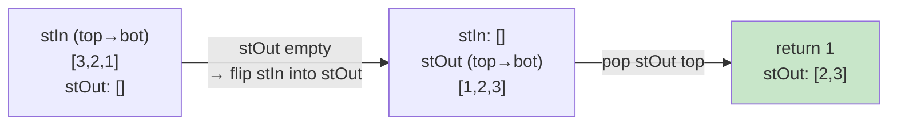

# 0232. Implement Queue using Stacks / 用栈实现队列

!!! info "Meta"
    - **Difficulty**: Easy
    - **Tags**: Stack, Queue, Design · 栈, 队列, 设计
    - **Link**: [LeetCode](https://leetcode.com/problems/implement-queue-using-stacks/)
    - **Status**: ✅ Solved
    - **First solved**: 2026-05-04
    - **Reviewed**: ☐ ☐ ☐

## Problem / 题意

**EN**: Build a FIFO queue (`push` / `pop` / `peek` / `empty`) using only standard LIFO stack ops (push top, pop top, peek top, empty).

**中文**: 只用 LIFO 栈的标准操作实现一个 FIFO 队列，要支持 `push` / `pop` / `peek` / `empty`。

## Approach / 思路

**EN**: Two stacks — `stIn` 收新数据，`stOut` 出数据。
- `push`: 直接进 `stIn`.
- `pop`: 如果 `stOut` 是空的，把 `stIn` 整个倒进 `stOut` —— 一倒，顺序就反过来了，`stOut` 的栈顶刚好是最早入队的。然后从 `stOut` pop。如果 `stOut` 还有东西，就别动 `stIn`，直接从 `stOut` pop。
- `peek`: 复用 `pop()` 拿到值，再 push 回 `stOut`.
- `empty`: 两个都空才算空。

**中文**: 关键是"懒搬运"—— 只在 `stOut` 用空了才从 `stIn` 整个倒过来，这样每个元素最多被搬两次（入 stIn，再到 stOut），均摊 O(1)。

Key invariant / 关键不变量: `stOut` 里的栈顶永远是当前队列的队头（如果 `stOut` 非空）；`stIn` 里则是后来的元素，按入队顺序栈式堆叠。

### Visual / 图解

After `push 1,2,3` then `pop()`:



下次再 `pop()` 不用倒 —— `stOut` 还有 `[2,3]`，直接 pop 拿到 `2`。

## Solution / 题解

=== "Python"
    ```python
    class MyQueue:
        def __init__(self):
            self.st_in: list[int] = []
            self.st_out: list[int] = []

        def push(self, x: int) -> None:
            self.st_in.append(x)

        def pop(self) -> int:
            if not self.st_out:
                while self.st_in:
                    self.st_out.append(self.st_in.pop())
            return self.st_out.pop()

        def peek(self) -> int:
            res = self.pop()
            self.st_out.append(res)
            return res

        def empty(self) -> bool:
            return not self.st_in and not self.st_out
    ```

=== "C++"
    ```cpp
    class MyQueue {
    public:
        stack<int> stIn;
        stack<int> stOut;

        MyQueue() {}

        void push(int x) {
            stIn.push(x);
        }

        int pop() {
            if (stOut.empty()) {
                while (!stIn.empty()) {
                    stOut.push(stIn.top());
                    stIn.pop();
                }
            }
            int res = stOut.top();
            stOut.pop();
            return res;
        }

        int peek() {
            int res = this->pop();
            stOut.push(res);
            return res;
        }

        bool empty() {
            return stIn.empty() && stOut.empty();
        }
    };
    ```

=== "Java"
    ```java
    // TBD
    ```

## Complexity / 复杂度

- **Time**: `push` O(1), `pop` / `peek` 均摊 O(1)（每个元素最多被搬两次：进 stIn → 翻到 stOut → 弹出）.
- **Space**: O(n).

## Pitfalls / 易错点

- **千万只在 `stOut` 空的时候才倒** —— 如果每次 pop 都倒一遍，顺序会乱掉（`stOut` 里剩的元素其实是更早入队的，不能再被新搬来的盖住）。
- `peek()` 复用 `pop()` 然后 push 回 `stOut`（不是 `stIn`！）—— 因为 peek 出来的是当前队头，它属于"已经翻面"的那一侧。
- `empty()` 一定是两个 stack 同时空，单看 `stIn` 会漏 `stOut` 里还没弹出的元素。
- C++ 里 `stack::pop()` 不返回值 —— 要先 `top()` 拿到再 `pop()`。Python 的 `list.pop()` 直接返回，写起来更顺。

## Related / 相关题目

- [0225. Implement Stack using Queues / 用队列实现栈](../0225-implement-stack-using-queues/README.md) — 反过来，用队列实现栈
