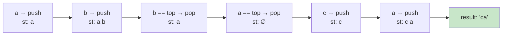

# 1047. Remove All Adjacent Duplicates In String / 删除字符串中的所有相邻重复项

!!! info "Meta"
    - **Difficulty**: Easy
    - **Tags**: Stack, String · 栈, 字符串
    - **Link**: [LeetCode](https://leetcode.com/problems/remove-all-adjacent-duplicates-in-string/)
    - **Status**: ✅ Solved
    - **First solved**: 2026-05-04
    - **Reviewed**: ☑ ☐ ☐

## Problem

**EN**: Repeatedly remove any two adjacent equal letters until no such pair remains, then return the resulting string. The deletions can cascade — removing one pair may bring a new pair together.

**中文**: 反复删除字符串里相邻且相等的两个字母，直到没有这样的相邻对为止，返回最终字符串。删除会"连锁"——删完一对可能让新一对贴上。

## 思路

**EN**: Walk the string left-to-right and use a stack as a "rejection buffer":
- 当前字符 `c` 跟栈顶相等？→ 抵消，pop。
- 否则 → push 进去等以后被抵消。

扫完一遍，栈里剩下的就是答案。**核心不变量**: 栈里任意相邻两个元素都不相等 (push 之前先检查过)，所以删除完毕后状态自然合法。

**中文**: 把栈当成"未配对的字符缓冲"——和栈顶一样就消掉，否则压栈。一遍扫完，栈里残留的就是答案。

### Summary / 套路总结

EN summary: This is the same shape as **Valid Parentheses (0020)** — both use a stack to "cancel on match, push otherwise." The difference is just the matching predicate (`==` here vs. paired-bracket lookup there). Whenever a problem says *"repeatedly remove pairs until no more pairs"* or *"adjacent cancellation"*, a stack scan is almost always O(n) and one-pass.

中文小结: 套路 = **遇到匹配就消、不匹配就压**。能套用：括号匹配 (0020)、相邻消除、单调栈预备（数据结构一样，比较条件不同而已）。

### 图解

Trace `"abbaca"`:



## Solution

### Variant A — explicit stack / 显式栈（提交版本）

=== "Python"
    ```python
    class Solution:
        def removeDuplicates(self, s: str) -> str:
            st: list[str] = []
            for c in s:
                if st and st[-1] == c:
                    st.pop()
                else:
                    st.append(c)
            return ''.join(st)
    ```

=== "C++"
    ```cpp
    class Solution {
    public:
        string removeDuplicates(string s) {
            stack<char> st;
            for (char c : s) {
                if (!st.empty() && c == st.top()) {
                    st.pop();
                } else {
                    st.push(c);
                }
            }
            string res;
            while (!st.empty()) {
                res += st.top();   // 先 top 拿值
                st.pop();          // 再 pop 出栈 —— C++ stack::pop 不返回值
            }
            reverse(res.begin(), res.end());
            return res;
        }
    };
    ```

=== "Java"
    ```java
    // TBD
    ```

### Variant B — string as the stack / 用 string 当栈

**EN**: `std::string` already exposes `back()` / `pop_back()` / `push_back()` — it *is* a stack of chars. Use it directly and skip the reverse step.

**中文**: `string` 本身就有 `back()`/`pop_back()`/`push_back()`，干脆把它当栈用，最后不用 reverse。

=== "Python"
    ```python
    class Solution:
        def removeDuplicates(self, s: str) -> str:
            # list-as-stack already builds in correct order; same as Variant A
            st: list[str] = []
            for c in s:
                if st and st[-1] == c:
                    st.pop()
                else:
                    st.append(c)
            return ''.join(st)
    ```

=== "C++"
    ```cpp
    class Solution {
    public:
        string removeDuplicates(string s) {
            string st;  // string-as-stack
            for (char c : s) {
                if (!st.empty() && st.back() == c) st.pop_back();
                else st.push_back(c);
            }
            return st;  // 已经是正确顺序，无需 reverse
        }
    };
    ```

## Complexity

- **Time**: O(n) — each char pushed and popped at most once.
- **Space**: O(n) — output string / stack worst case (no cancellations).

## 易错点

- **C++ `stack::pop()` 不返回值** —— 必须 `top()` 拿到再 `pop()`，写成两行：
  ```cpp
  res += st.top();
  st.pop();
  ```
  写成 `res += st.pop()` 编不过。Python 的 `list.pop()` 返回值，更顺手。
- 别忘了**判空再比较栈顶**: `if (!st.empty() && c == st.top())` —— 顺序反了对空栈调 `top()` 是 UB (C++) / IndexError (Python)。`&&` 短路救了你，但写法本身要清楚。
- 用显式 `stack<char>` 时最后要 reverse —— 因为弹栈顺序是反的。改用 `string`/`list` 直接 push 就不用 reverse。这两个细节经常忘一个。
- 不要用 `string::erase` 在原 string 上改，会变成 O(n²)（每次 erase 移动后续字符）。

## 相关题目

- [0020. Valid Parentheses / 有效的括号](../0020-valid-parentheses/README.md) — 同样的"匹配就消，不匹配就压"套路，只是匹配条件不同
- [0225. Implement Stack using Queues](../0225-implement-stack-using-queues/README.md) — 栈本身的实现
- 0844. Backspace String Compare (待补) — 同模式：把 `#` 当成"消上一个"的指令
- [0150. Evaluate Reverse Polish Notation / 逆波兰表达式求值](../0150-evaluate-reverse-polish-notation/README.md) — 栈处理表达式
