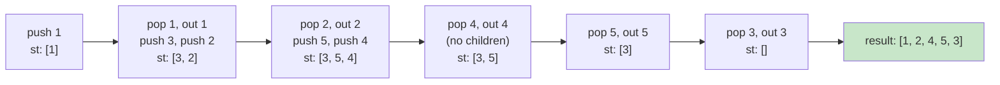

# 0144. Binary Tree Preorder Traversal / 二叉树的前序遍历

!!! info "Meta"
    - **Difficulty**: Easy
    - **Tags**: Tree, DFS, Stack · 二叉树, 深度优先搜索, 栈
    - **Link**: [LeetCode](https://leetcode.com/problems/binary-tree-preorder-traversal/)
    - **Status**: ✅ Solved
    - **Reviewed**: ☑ ☑ ☐

## Problem

**EN**: Return the **preorder** traversal (root → left → right) of a binary tree's values.

**中文**: 返回二叉树的**前序**遍历 (根 → 左 → 右) 数组.

## 思路

### Core idea

DFS, 访问顺序 **根 → 左 → 右**. 两条路:

- **递归**: 一行就是 `visit(root); recurse(left); recurse(right)`.
- **迭代**: 用栈模拟递归. 关键是**先压右孩子, 再压左孩子** —— LIFO, 弹出时左先于右.

### Key Insights

1. **迭代版的"右先压, 左后压" / Iterative push order**

    栈是 LIFO, 想让左孩子先被处理, 就得让左孩子**后**进栈 → push 顺序是 right → left. 反过来写就成了"根 → 右 → 左"前序的镜像了.

2. **C++ helper 用引用传 vector / Pass `vector<int>&`, not `vector<int>`**

    递归 helper `traversal(TreeNode*, vector<int>& vec)` 必须用 `&` —— 不然每次递归都**整体拷贝**结果 vector, 时间空间双爆 (O(n²) 内存, 退化的话还会 stack overflow). Python/JS 没这问题, 它们的 list/array 默认就是引用传递.

### 可迁移思路

- **0094 Inorder / 0145 Postorder** (待补) —— 完全同款, 只是"输出 root 的时机"挪一下: pre = 进入时输出, in = 左完后输出, post = 左右都完后输出. 迭代版思路同样是栈, 但 inorder 写法稍麻烦.
- **统一迭代模板 (NULL marker)** —— 一种用栈 + nullptr 标记的迭代写法, 一份代码改一行就能切前/中/后序. 等三种都熟了再来抽象.
- **0102 Level Order** (待补) —— BFS, 把栈换成队列, 遍历方向就从 DFS 变 BFS.
- **回溯模板** —— 回溯本质就是 DFS 前序 + 撤销操作. 这里走通了 DFS, 后面回溯 (子集 / 排列 / 组合) 容易接上.

### 一句话总结

**Preorder = visit, left, right. 递归一行就完事; 迭代用栈, 注意右先压左后压. C++ helper 一定要 `vector<int>&` 不要值传.**

### 图解

Tree:

```
      1
     / \
    2   3
   / \
  4   5
```

Preorder visit order: **1 → 2 → 4 → 5 → 3**.

Iterative trace (stack from bottom to top):



## Solution

### Variant A — recursion / 递归

=== "C++"
    ```cpp
    class Solution {
    public:
        // & is critical: vec is shared across all recursive calls.
        // Without &, every call would copy the whole vector → O(n²) memory.
        void traversal(TreeNode* cur, vector<int>& vec) {
            if (!cur) return;
            vec.push_back(cur->val);   // root
            traversal(cur->left,  vec); // left
            traversal(cur->right, vec); // right
        }
        vector<int> preorderTraversal(TreeNode* root) {
            vector<int> res;
            traversal(root, res);
            return res;
        }
    };
    ```

=== "Python"
    ```python
    # Definition for a binary tree node:
    # class TreeNode:
    #     def __init__(self, val=0, left=None, right=None):
    #         self.val = val
    #         self.left = left
    #         self.right = right

    class Solution:
        def preorderTraversal(self, root: 'TreeNode | None') -> list[int]:
            # In Python, lists are passed by reference by default —— no need for the
            # C++ '&' dance. The helper just appends in place.
            #   C++ 等价: traversal(TreeNode*, vector<int>& vec)
            res: list[int] = []
            def dfs(node):
                if not node:
                    return
                res.append(node.val)   # root
                dfs(node.left)         # left
                dfs(node.right)        # right
            dfs(root)
            return res
    ```

=== "JavaScript"
    ```javascript
    /**
     * Definition for a binary tree node.
     * function TreeNode(val, left, right) {
     *     this.val  = (val  === undefined ? 0    : val);
     *     this.left = (left === undefined ? null : left);
     *     this.right= (right=== undefined ? null : right);
     * }
     */
    /**
     * @param {TreeNode} root
     * @return {number[]}
     */
    var preorderTraversal = function(root) {
        // JS arrays are reference types — pushing inside the closure mutates the
        // outer res, no '&' equivalent needed. Same as Python.
        const res = [];
        const dfs = (node) => {
            if (!node) return;
            res.push(node.val);   // root
            dfs(node.left);       // left
            dfs(node.right);      // right
        };
        dfs(root);
        return res;
    };
    ```

### Variant B — iterative with stack / 迭代用栈

=== "C++"
    ```cpp
    class Solution {
    public:
        vector<int> preorderTraversal(TreeNode* root) {
            vector<int> res;
            if (!root) return res;
            stack<TreeNode*> st;
            st.push(root);
            while (!st.empty()) {
                TreeNode* node = st.top();
                st.pop();
                res.push_back(node->val);
                // 右先压, 左后压 —— LIFO 翻面后正好是"左先弹"
                if (node->right) st.push(node->right);
                if (node->left)  st.push(node->left);
            }
            return res;
        }
    };
    ```

=== "Python"
    ```python
    class Solution:
        def preorderTraversal(self, root: 'TreeNode | None') -> list[int]:
            if not root:
                return []
            # list as stack —— Python 没有专门的 stack 类型, list.append/pop 就是.
            #   C++ 等价: stack<TreeNode*>
            res: list[int] = []
            stack = [root]
            while stack:
                node = stack.pop()        # default pops the last element (LIFO)
                res.append(node.val)
                # 右先压, 左后压
                if node.right:
                    stack.append(node.right)
                if node.left:
                    stack.append(node.left)
            return res
    ```

=== "JavaScript"
    ```javascript
    var preorderTraversal = function(root) {
        if (!root) return [];
        // Array as stack: push to end, pop from end. Same shape as Python list / C++ vector.
        const res = [];
        const stack = [root];
        while (stack.length > 0) {
            // arr.pop() removes and returns the LAST element — LIFO.
            // (For FIFO you'd want arr.shift(), but that's O(n) — careful.)
            const node = stack.pop();
            res.push(node.val);
            // right first, left second
            if (node.right) stack.push(node.right);
            if (node.left)  stack.push(node.left);
        }
        return res;
    };
    ```

## Complexity

- **Time**: O(n) — 每个节点访问一次.
- **Space**: O(n) for the output. Recursion stack / explicit stack 最坏 O(n) (skewed tree), 平均 O(log n) (balanced).

## 易错点

- **C++ helper 不加 `&`** —— 每次递归整体拷贝 vector, O(n²) 内存, 大树直接 MLE. Python/JS 没这坑.
- **迭代时压栈顺序写反** —— `right` 必须先压. 写成"左先压、右后压"就变成根→右→左 (preorder 的镜像) 了.
- **空树**: 别忘了 `if (!root) return res;`. 否则 `st.push(root)` 把 nullptr 压进去, 之后 `node->val` 崩.
- **JS `stack.shift()` vs `stack.pop()`**: `shift` 弹首元素 (O(n)) 是模拟队列, `pop` 弹尾元素 (O(1)) 才是栈. 别手快写错.

## 相关题目

- [0094. Binary Tree Inorder Traversal / 二叉树的中序遍历](../0094-binary-tree-inorder-traversal/README.md) — 中序: 左 → 根 → 右
- [0145. Binary Tree Postorder Traversal / 二叉树的后序遍历](../0145-binary-tree-postorder-traversal/README.md) — 后序: 左 → 右 → 根
- 0102. Binary Tree Level Order Traversal (待补) — BFS, 栈换队列
- [0020. Valid Parentheses](../../06-stack-queue/0020-valid-parentheses/README.md) — 同样的"用栈做 DFS-style 处理"模式
- [0071. Simplify Path](../../06-stack-queue/0071-simplify-path/README.md) — 栈模拟另一种"层级"
