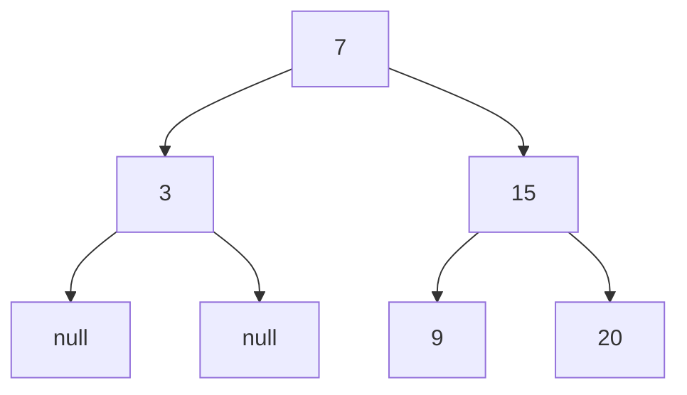

# 0173. Binary Search Tree Iterator / 二叉搜索树迭代器

!!! info "Meta"
    - **Difficulty**: Medium
    - **Tags**: Tree, BST, Stack, Iterator, Design · 二叉树, 二叉搜索树, 栈, 迭代器, 设计
    - **Link**: [LeetCode](https://leetcode.com/problems/binary-search-tree-iterator/)
    - **Status**: ✅ Solved
    - **Reviewed**: ☑ ☐ ☐

## Problem

**EN**: Design an iterator over a BST that returns values in ascending order: `next()` returns the next smallest value, `hasNext()` returns whether more values exist. Both should be efficient.

**中文**: 设计一个 BST 迭代器, 按升序返回节点值. `next()` 返回下一个值, `hasNext()` 判断是否还有元素. 要求高效.

## 思路

### Core idea

**把 [0094 的迭代式中序](../0094-binary-tree-inorder-traversal/README.md) 拆开走**. 用一个栈持续维护"尚未访问的左脊" (left spine), 每次 `next()`:

1. 弹栈顶 — 它正好是下一个 inorder 节点 (栈不变量).
2. 把它的右子树的"左脊"全部推进栈 — 维持不变量.

`hasNext()` 就看栈空不空.

### Key Insights

1. **Stack invariant: 栈顶 = 下一个 inorder 节点 / Top of stack = next inorder value**

    任何时刻栈里都是"未访问但已经入队的祖先链 + 当前左下走过的路径". 栈顶必定是 inorder 序列里下一个该出的节点. 这个不变量靠两步维护:

    - **构造时** 把 root 的整条左脊推进去 — 最深的左孩子在栈顶, 就是 inorder 的第一个值.
    - **每次 `next()` 后** 弹出当前节点, 然后把它**右孩子的整条左脊**推进去 — 因为在 inorder 里, 当前节点之后下一个该访问的就是"右子树里最左的那个".

2. **Lazy inorder = 0094 拆成两半 / Iterative inorder split across calls**

    0094 的迭代式 inorder 模板:
    ```cpp
    while (!stk.empty() || cur) {
        while (cur) { stk.push(cur); cur = cur->left; }   // ← pushLeftPath
        cur = stk.top(); stk.pop();                       // ← next() 主体
        res.push_back(cur->val);
        cur = cur->right;                                 // ← next() 末尾 pushLeftPath(node->right)
    }
    ```
    把"压左脊"抽成 `pushLeftPath`, 把"弹+访问+换右"拆到 `next()` 里, 就是 0173. **代码量没变, 只是把控制流交给了调用者**.

3. **Amortized O(1) per `next()` / 均摊 O(1)**

    每个节点一生中只被 push 一次 + pop 一次 → 总功 O(n). 摊到 n 次 `next()` 调用上 → 平均 **O(1)**. 单次最坏 O(h) (极不平衡的树, 一次推一长串左脊).

4. **空间 O(h) 不是 O(n) / Space wins over "dump-to-array"**

    栈在任意时刻只装"当前一条左脊" — 平衡树时是 O(log n), 退化成链表时是 O(n). **远好于"先 inorder dump 进 vector 再迭代"**的 O(n) 死空间. 这是这题被设计成"iterator"而不是"return list"的原因.

5. **"Generator across function calls" 通用套路 / Turn traversal into an iterator**

    任何递归遍历都可以这样拆: 把递归用的**局部状态 (栈/queue/path)** 抬到**类成员**, 把"产出一个值"的那行变成 `return`. C++/Java 没原生 generator 时这是标准做法; Python 直接 `yield`, JS 直接 `function*`.

### 一句话总结

**用栈维护"未访问的左脊", 栈顶永远是下一个 inorder 值. `next()` 弹一个, 然后把它右子树的左脊推进去. 均摊 O(1), 空间 O(h).**

### 图解



构造完: stack = `[7, 3]` (栈顶 3).
`next()` → 3, stack 变成 `[7]`.
`next()` → 7, 然后压 15→9 的左脊: stack = `[15, 9]`.
`next()` → 9, stack = `[15]`.
`next()` → 15, 然后压 20 (没左脊): stack = `[20]`.
`next()` → 20, stack 空. `hasNext()` 返回 false.

## Solution

=== "C++"
    ```cpp
    class BSTIterator {
        stack<TreeNode*> stk;

        // 把 node 及其整条左脊推进栈
        void pushLeftPath(TreeNode* node) {
            while (node) {
                stk.push(node);
                node = node->left;
            }
        }
    public:
        BSTIterator(TreeNode* root) {
            pushLeftPath(root);
        }

        int next() {
            TreeNode* node = stk.top();
            stk.pop();
            pushLeftPath(node->right);   // 维持不变量: 栈顶 = 下一个 inorder
            return node->val;
        }

        bool hasNext() {
            return !stk.empty();
        }
    };
    ```

=== "Python"
    ```python
    class BSTIterator:
        def __init__(self, root: 'TreeNode | None'):
            self.stk = []                    # list 当 stack 用; .append / .pop() = push / pop
            self._push_left_path(root)

        def _push_left_path(self, node):
            while node:
                self.stk.append(node)
                node = node.left

        def next(self) -> int:
            node = self.stk.pop()            # pop() 默认从末尾 = stack top
            self._push_left_path(node.right)
            return node.val

        def hasNext(self) -> bool:
            return bool(self.stk)            # 非空 list 是 True
    ```

=== "JavaScript"
    ```javascript
    /**
     * @param {TreeNode} root
     */
    var BSTIterator = function(root) {
        this.stk = [];                       // 用数组当 stack: push / pop 操作 O(1)
        this._pushLeftPath(root);
    };

    BSTIterator.prototype._pushLeftPath = function(node) {
        while (node) {
            this.stk.push(node);
            node = node.left;
        }
    };

    /**
     * @return {number}
     */
    BSTIterator.prototype.next = function() {
        const node = this.stk.pop();
        this._pushLeftPath(node.right);
        return node.val;
    };

    /**
     * @return {boolean}
     */
    BSTIterator.prototype.hasNext = function() {
        return this.stk.length > 0;
    };
    ```

## Complexity

| Operation | Worst | Amortized |
|---|---|---|
| `next()` | O(h) | **O(1)** |
| `hasNext()` | O(1) | O(1) |
| Space | **O(h)** | — |

均摊证明: n 个节点一生只各被 push/pop 一次 → n 次 `next()` 总共 O(n) 操作 → 单次 O(1) avg.

## 易错点

- **构造函数别忘了 `pushLeftPath(root)`**: 不调的话栈是空的, 第一次 `next()` 就崩 / `hasNext()` 直接 false. 经典首调用 bug.
- **`pushLeftPath` 传的是 `node->right` 不是 `node`**: 弹出 `node` 之后, 它的左子树已经全访问完 (那条路径就是栈在压它之前推进去的). 接下来要"启动右子树的中序" → 推右子树的左脊.
- **不要把整棵树 inorder 进 vector 再迭代**: 实现简单但 O(n) 空间 + 构造 O(n), 失去 iterator 的意义. 面试官会扣分.
- **空树 / next 越界**: `pushLeftPath(nullptr)` while 循环不进入, 自然处理. 但调用方调 `next()` 时栈空就 UB — 题目保证不会调超, 不用特判.
- **C++ stack 用 `std::stack<TreeNode*>` 不是 `vector<TreeNode*>`**: 接口语义更准. 当然 vector + `back()`/`pop_back()` 也对.
- **不要把 `pushLeftPath` 写成递归**: 递归版逻辑没错但用了系统栈, 失去"用显式栈控制空间"的意义 — 而且这题就是要练显式栈.

## 相关题目

- [0094. Binary Tree Inorder Traversal](../0094-binary-tree-inorder-traversal/README.md) — 同款迭代式中序模板, 这题是它的"拆开版"
- [0144. Binary Tree Preorder Traversal](../0144-binary-tree-preorder-traversal/README.md) — 同款 iterative DFS, 不同顺序
- [0098. Validate BST](../0098-validate-binary-search-tree/README.md) — 也用 inorder + prev 节点的模式 (那题 prev 是单变量, 这题 prev 是栈)
- [0530. Minimum Absolute Difference in BST](../0530-minimum-absolute-difference-in-bst/README.md) — inorder aggregate, 可以改成"用 0173 iterator + 单 prev"
- [0230. Kth Smallest Element in a BST](../0230-kth-smallest-element-in-a-bst/README.md) — 直接 `for i in range(k): it.next()` 就完了, 或把这题逻辑内联展开
- 0341. Flatten Nested List Iterator (待补) — 同款"递归遍历 → 用栈拆成 iterator"
