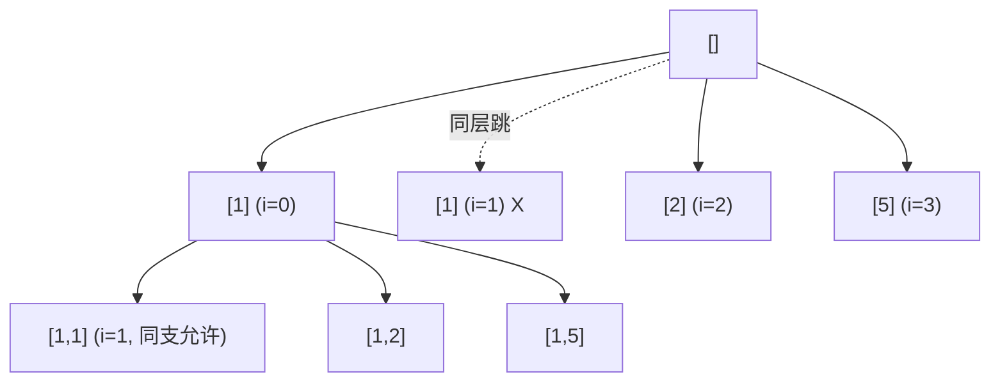

# 0040. Combination Sum II / 组合总和 II

!!! info "Meta"
    - **Difficulty**: Medium
    - **Tags**: Backtracking, Array, Sort · 回溯, 数组, 排序
    - **Link**: [LeetCode](https://leetcode.com/problems/combination-sum-ii/)
    - **Status**: ✅ Solved
    - **Reviewed**: ☐ ☐ ☐

## Problem

**EN**: Given `candidates` (**may contain duplicates**) and `target`, return all unique combinations summing to `target`. **Each candidate position used at most once.** The result must not contain duplicate combinations.

**中文**: 给一组**可能含重复值**的正整数 `candidates` 和正整数 `target`, 返回所有和为 `target` 的不同组合. **每个位置最多用一次**. 结果中不能有重复组合.

## 思路

### Core idea

入口先 `sort(candidates)`. 回溯三件套不变, `recurse(i + 1)` 表示每个位置只能用一次 (跟 [0039](../0039-combination-sum/README.md) 的 `recurse(i)` 区分). **核心** 加一行 **同层去重**:

```cpp
if (i > start && candidates[i] == candidates[i - 1]) continue;
```

- `i > start`: 当前不是这一层的第一个选项 (即有"兄弟"曾经在同层选过).
- `candidates[i] == candidates[i - 1]`: 当前值和前一个相同.

两者同时满足 → **同层同值, 跳过**. 防止生成重复组合.

### Key Insights

1. **同层去重 vs 同支允许同值 / Sibling-dedup, not ancestor-dedup**

    思考为啥这么写. 例: `candidates = [1, 1, 2, 5]`, target = 8. 排序后变成 `[1, 1, 2, 5]`. 在 startIndex=0 那层:

    - 选第一个 1, 进 path = [1], 然后 startIndex=1, 再选 1 → path = [1, 1] **合法** (用了不同位置).
    - 回到 startIndex=0 层, 试第二个 1 (i=1). 这里 `i > start=0` ✅, `candidates[1] == candidates[0]` ✅ → **跳**.

    为啥跳? 因为以"第二个 1" 起头的所有 path, 都是以"第一个 1" 起头那批 path 的子集 (`[1,...]` vs `[1,...]` 完全等价). 不跳的话, 整棵子树会被重复生成两次.

2. **`i > start` 不是 `i > 0` / Same-level only**

    把 `i > start` 写成 `i > 0` 会一并把"同 path 中后续的相同值"也跳掉 → `[1, 1]` 这种合法 path 就**生成不出来**了. `i > start` 精准锁定"同层兄弟", 不影响"垂直方向"的同值使用.

    这是 0040 的难点也是亮点. 记住口诀: **"树枝去重 (path 内的同值) 留, 树层去重 (同 startIndex 的兄弟同值) 跳"**.

3. **必须先 sort / Sorting is mandatory**

    `candidates[i] == candidates[i-1]` 只有在相同值挨在一起时才能用. 不排序的话, `[1, 2, 1]` 这种相同值分散开, 这个判断捕捉不到.

    顺带福利: 排序后还能开 `curSum + candidates[i] > target` 的 **break** 剪枝 (而不是 continue).

4. **跟 [0039](../0039-combination-sum/README.md) 的差别 / Three deltas from 0039**

    | 项 | 0039 | 0040 |
    |---|---|---|
    | candidates | 互不相同 | **可能有重复** |
    | 同元素能否重复 | ✅ 无限次 | ❌ 每位置一次 |
    | 下一层起点 | `i` | `i + 1` |
    | 去重机制 | startIndex 顺序 | startIndex 顺序 **+ 同层跳重值** |
    | 是否必须 sort | 不必 (能加剪枝) | **必须** (去重依赖) |

5. **`used[]` 替代写法 (Carl 流) / Alternative dedup with `used[]`**

    另一种等价写法:
    ```cpp
    if (i > 0 && candidates[i] == candidates[i-1] && !used[i-1]) continue;
    ```
    含义: 前一个相同值如果在当前 path 上**没用过** (`!used[i-1]`), 说明现在踩在"同层第二个相同值" 上 → 跳. 如果用过, 说明是"同 path 垂直方向", 允许.

    两种写法等价. `i > start` 版更短, `used[]` 版能跟 0046/0047 全排列 (待补) 的去重模板统一. 自选风格.

6. **`curSum + candidates[i] > target` 用 `break` 不是 `continue`**

    因为排序了, 当前 i 超 target, 后面 i 全超. 整个循环 break. **Yang 这版主动开了**, 比 0039 的 `curSum > target` 在入口 return 紧一档.

### 一句话总结

**`sort(candidates)` + 回溯三件套 + 同层去重一行 (`i > start && candidates[i] == candidates[i-1]`). 树枝同值留, 树层同值跳.**

### 图解

`candidates = [1, 1, 2, 5]`, target = 8, 排序后 `[1, 1, 2, 5]`. 第 0 层:



`i=1` 在 startIndex=0 那层被跳, 但 `i=1` 在 startIndex=1 那层 (即从 path=[1] 出发) 是允许的 — 因为 `i > start` 此时是 `1 > 1` = false.

## Solution

=== "C++"
    ```cpp
    class Solution {
    public:
        vector<vector<int>> res;
        vector<int> path;
        void backtracking(const vector<int>& candidates, int target, int curSum, int start) {
            if (curSum == target) {
                res.push_back(path);
                return;
            }
            for (int i = start; i < (int)candidates.size(); i++) {
                if (curSum + candidates[i] > target) break;                        // 排序 + break 剪枝
                if (i > start && candidates[i] == candidates[i - 1]) continue;    // 同层同值: 跳
                path.push_back(candidates[i]);
                backtracking(candidates, target, curSum + candidates[i], i + 1);  // i+1: 每位置只一次
                path.pop_back();
            }
        }
        vector<vector<int>> combinationSum2(vector<int>& candidates, int target) {
            sort(candidates.begin(), candidates.end());                           // 必须排序: 去重依赖
            backtracking(candidates, target, 0, 0);
            return res;
        }
    };
    ```

=== "Python"
    ```python
    class Solution:
        def combinationSum2(self, candidates: list[int], target: int) -> list[list[int]]:
            candidates.sort()                                # in-place 排序, 等价 C++ std::sort
            res, path = [], []
            def backtrack(start: int, cur_sum: int):
                if cur_sum == target:
                    res.append(path[:])                      # 切片快照
                    return
                for i in range(start, len(candidates)):
                    if cur_sum + candidates[i] > target:
                        break                                # 剪枝
                    if i > start and candidates[i] == candidates[i - 1]:
                        continue                             # 同层去重
                    path.append(candidates[i])
                    backtrack(i + 1, cur_sum + candidates[i])
                    path.pop()
            backtrack(0, 0)
            return res
    ```

=== "JavaScript"
    ```javascript
    /**
     * @param {number[]} candidates
     * @param {number} target
     * @return {number[][]}
     */
    var combinationSum2 = function(candidates, target) {
        candidates.sort((a, b) => a - b);                    // 数字排序必须给 compareFn, 默认是字典序
        const res = [], path = [];
        const backtrack = (start, curSum) => {
            if (curSum === target) {
                res.push([...path]);
                return;
            }
            for (let i = start; i < candidates.length; i++) {
                if (curSum + candidates[i] > target) break;
                if (i > start && candidates[i] === candidates[i - 1]) continue;  // 同层去重
                path.push(candidates[i]);
                backtrack(i + 1, curSum + candidates[i]);
                path.pop();
            }
        };
        backtrack(0, 0);
        return res;
    };
    ```

## Complexity

- **Time**: O(2^n × n) 最坏 (每元素选或不选 × 拷贝). 实际剪枝后远小.
- **Space**: O(n) recursion + path.

## 易错点

- **`i > start` 不是 `i > 0`**: 这是 0040 唯一容易写错的点. 写成 `i > 0` 会丢答案 (例如 `[1,1]` 这种合法 path). 反复盯紧这一行.
- **没 sort 直接做去重**: 没排序的话 `candidates[i] == candidates[i-1]` 几乎检测不到任何东西 → 大量重复组合.
- **JS 的 `sort()` 必须给 compareFn**: 默认是字典序, `[10, 2, 1].sort()` 会得到 `[1, 10, 2]`. 必须 `sort((a,b) => a-b)`.
- **`recurse(i + 1)` 不是 `i`**: 跟 0039 的标志性差别. 写错变成 0039.
- **`curSum > target` 改成 `curSum + candidates[i] > target` + break**: 这是排序之后才能开的更紧剪枝. Yang 这版主动开了, 学回去.
- **`size_t` vs int 在 C++ 里**: `candidates.size()` 是 unsigned. 别在循环里跟负数比较. Cast 到 int 保险.

## 相关题目

- [0039. Combination Sum](../0039-combination-sum/README.md) — 直接前置, 元素唯一 + 允许重复用
- [0077. Combinations](../0077-combinations/README.md) — 基础组合, 无 sum 约束
- [0216. Combination Sum III](../0216-combination-sum-iii/README.md) — sum + 个数固定的版本
- [0090. Subsets II](../0090-subsets-ii/README.md) — 子集版本的同层去重, 套路完全一样
- 0047\. Permutations II (待补) — 排列版本的同层去重, 用 `used[]` 而非 startIndex
- 0491\. Non-decreasing Subsequences (待补) — 不能 sort (会破坏 subsequence 顺序), 用 set 同层去重
