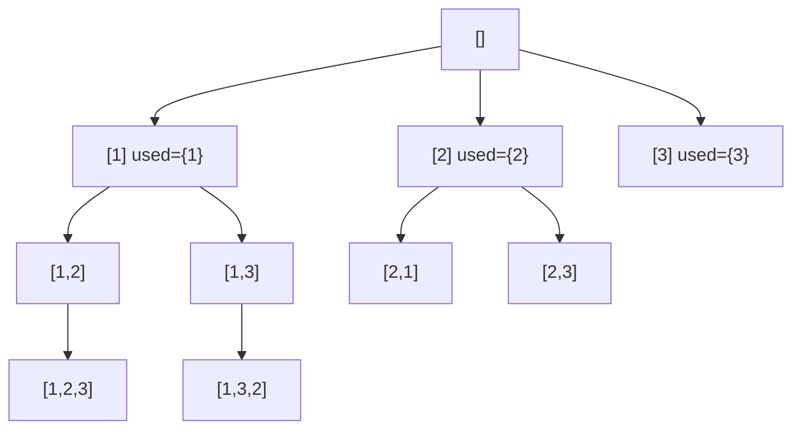

# 0046. Permutations / 全排列

!!! info "Meta"
    - **Difficulty**: Medium
    - **Tags**: Backtracking, Array · 回溯, 数组
    - **Link**: [LeetCode](https://leetcode.com/problems/permutations/)
    - **Status**: ✅ Solved
    - **Reviewed**: ☐ ☐ ☐

## Problem

**EN**: Given an array of **distinct** integers `nums`, return all possible **permutations** (order matters). You may return them in any order.

**中文**: 给一组**互不相同**的整数 `nums`, 返回所有可能的**排列** (顺序敏感). 返回顺序不限.

## 思路

### Core idea

排列要把 `[1,2]` 和 `[2,1]` 都算上, 不能用组合的 `startIndex` 单向. 改用一个布尔数组 `used[]`:

- for 循环每次都**从 `i = 0` 开始** (不再 `i = start`).
- 用 `used[i] = true` 标记"当前 path 已经包含 `nums[i]` 这个位置", 进入时打标 / 退出时撤标.
- `path.size() == nums.size()` 时收果实.

### Key Insights

1. **`used[]` 替代 `startIndex` / The defining shift to permutation**

    | 系列 | 推进机制 | 含义 |
    |---|---|---|
    | 组合 / 子集 ([0077](../0077-combinations/README.md) / [0078](../0078-subsets/README.md)) | `startIndex` 单向往后选 | 同 multiset 算一种, 防 `[1,2]` 跟 `[2,1]` 重复 |
    | **排列 (本题)** | `used[]` + for 从 0 开始 | 顺序敏感, `[1,2]` 跟 `[2,1]` 是两种 |

    一句话: **无序 → startIndex; 有序 → used[]**. 这是 [0077](../0077-combinations/README.md) Insight 2 表里早就预告过的轴.

2. **`used[i]` 是"path 内是否包含这个位置"标记 / Per-path position marker**

    跟 [0491](../0491-non-decreasing-subsequences/README.md) 的 `unordered_set` 不同: 那个 set 是 "**这一层**是否已经选过这个值" (同层去重), 是 per-call. `used[]` 是 "**当前 path** 是否已经用过这个位置" (避免重复选自己), 是 per-path.

    > 一个看深度 (path), 一个看广度 (level). 别混.

3. **进入打标 / 退出撤标 同 push/pop / Mirror push/pop**

    ```cpp
    used[i] = true;   path.push_back(nums[i]);
    backtrack(...);
    used[i] = false;  path.pop_back();
    ```
    四行成对的"做记号 + 撤记号" + "push + pop". 漏 `used[i] = false` 是这题最经典的 bug — 某个位置被永久标记, 之后回到那条岔路用不了它 → 大批排列丢失.

4. **回溯系列三轴框架已完整 / Three-axis framework complete**

    Yang 现在见过的所有回溯题, 都是这三轴的组合:

    | 轴 | 选项 |
    |---|---|
    | **候选生成** | 单集合 startIndex / 多集合 idx 推进 / 切割 (start+end) |
    | **收果实时机** | path 满 / 每个节点 / 长度 ≥ 2 / curSum 等 target |
    | **去重机制** | startIndex (顺序无关) / used[] (排列) / sort + 相邻 (有重 + 可 sort) / set 任意位置 (有重 + 不能 sort) |

    新题大概率是这三轴的一个新组合 — 知道是哪个 cell, 模板自动套.

5. **复杂度 O(n × n!) / Factorial explosion**

    n! 个排列 × 每个拷贝 O(n) = O(n × n!). n=10 ≈ 3.6M, n=12 ≈ 480M. 题目 n ≤ 6/7 才允许暴力枚举.

### 一句话总结

**`used[]` 标记 path 内已用位置; for 从 0 开始; 进入打标 / 退出撤标 同 push/pop. 排列 = 组合丢掉 startIndex 换 used[].**

### 图解

`nums = [1, 2, 3]` 的决策树:



`[1,2]` 和 `[2,1]` 都算 — 因为每层 for 都从 0 开始, used 阻止重复同位置.

## Solution

=== "C++"
    ```cpp
    class Solution {
    public:
        vector<vector<int>> res;
        vector<int> path;
        vector<bool> used;
        void backtrack(vector<int>& nums) {
            if (path.size() == nums.size()) {
                res.push_back(path);
                return;
            }
            for (int i = 0; i < (int)nums.size(); i++) {       // 每层都从 0 开始
                if (used[i]) continue;                          // path 已用此位置, 跳
                used[i] = true;
                path.push_back(nums[i]);
                backtrack(nums);
                used[i] = false;                                // 撤记号
                path.pop_back();
            }
        }
        vector<vector<int>> permute(vector<int>& nums) {
            used.assign(nums.size(), false);
            backtrack(nums);
            return res;
        }
    };
    ```

=== "Python"
    ```python
    class Solution:
        def permute(self, nums: list[int]) -> list[list[int]]:
            res, path = [], []
            used = [False] * len(nums)                          # 跟 nums 等长
            def backtrack():
                if len(path) == len(nums):
                    res.append(path[:])
                    return
                for i in range(len(nums)):                      # 不是 range(start, n)
                    if used[i]:
                        continue
                    used[i] = True
                    path.append(nums[i])
                    backtrack()
                    used[i] = False                             # 撤记号
                    path.pop()
            backtrack()
            return res
        # Pythonic 一行: return list(itertools.permutations(nums)) — 但拿到的是 tuple, 不是 list
    ```

=== "JavaScript"
    ```javascript
    /**
     * @param {number[]} nums
     * @return {number[][]}
     */
    var permute = function(nums) {
        const res = [], path = [];
        const used = new Array(nums.length).fill(false);        // 跟 nums 等长
        const backtrack = () => {
            if (path.length === nums.length) {
                res.push([...path]);
                return;
            }
            for (let i = 0; i < nums.length; i++) {
                if (used[i]) continue;
                used[i] = true;
                path.push(nums[i]);
                backtrack();
                used[i] = false;
                path.pop();
            }
        };
        backtrack();
        return res;
    };
    ```

## Complexity

- **Time**: O(n × n!) — n! 个排列, 每个拷贝 O(n).
- **Space**: O(n) recursion + path + used.

## 易错点

- **`used[i] = false` 必须在 dfs 之后**: 漏掉这一行, 某个位置被永久标记, 同层后续兄弟也用不了它 → 大批排列直接丢. 这是排列回溯最常见的 bug.
- **for 从 `i = 0` 开始, 不是 `i = start`**: 写成 `start` 就退化成组合 (0077). 排列必须每层都把所有未用位置再试一遍.

## 相关题目

- [0077. Combinations](../0077-combinations/README.md) — 组合的对照: startIndex 单向防顺序重复
- [0078. Subsets](../0078-subsets/README.md) — 同款 startIndex 系列
- [0040. Combination Sum II](../0040-combination-sum-ii/README.md) — sort + 相邻去重的模板, 0047 排列 II 会借鉴
- 0047\. Permutations II (待补) — 排列版的同层去重 (sort + `used[i-1] == false`)
- 0031\. Next Permutation (待补) — 不枚举所有, 只算下一个; O(n) 数论
- 0060\. Permutation Sequence (待补) — 第 k 个排列, 用阶乘进制直接定位, 不暴力枚举
- 0784\. Letter Case Permutation (待补) — 每位选大小写, 形态更像 0017 (多集合)
