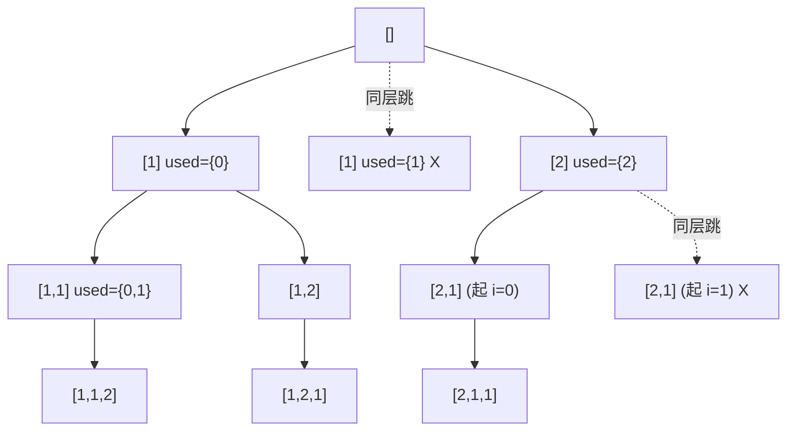

# 0047. Permutations II / 全排列 II

!!! info "Meta"
    - **Difficulty**: Medium
    - **Tags**: Backtracking, Array, Sort · 回溯, 数组, 排序
    - **Link**: [LeetCode](https://leetcode.com/problems/permutations-ii/)
    - **Status**: ✅ Solved
    - **Reviewed**: ☐ ☐ ☐

## Problem

**EN**: Given an array `nums` that **may contain duplicates**, return all possible **unique** permutations. The result must not contain duplicate permutations.

**中文**: 给一个**可能有重复值**的数组 `nums`, 返回所有可能的**不同**排列. 结果不能重复.

## 思路

### Core idea

**[0046](../0046-permutations/README.md) `used[]` 模板 + 排序 + 同层去重一行**:

```cpp
if (i > 0 && nums[i] == nums[i - 1] && !used[i - 1]) continue;
```

Yang 的一句话总结: "**LC 46 的 used[] 模板 + 排序 + 多一行 `!used[i-1]` 判断 — 在选 nums[i] 之前检查'前一个相同值是否在同层用过'**". 句句到位.

### Key Insights

1. **同层去重的"used[]"形式 / Same-level dedup, permutation flavor**

    `!used[i-1]` 的含义:

    - `nums[i] == nums[i-1]` → 当前值跟前一个相同 (排序后才挨在一起, 所以 sort 是前置条件).
    - `!used[i-1]` → 前一个相同值**不在当前 path** (即上一次进入它的分支已经 dfs 完 + pop 回退 + `used[i-1] = false`). 这就说明: **它是同一层 (同一个 for 循环) 里的"兄弟"** — 选第二个 `nums[i]` 走的 path 跟选第一个一模一样, **整棵子树重复**, 必须跳.

    反过来 `used[i-1] == true` → 前一个相同值**在 path 里** (祖先链上). 此时选 `nums[i]` 是 **垂直方向**用同值, 是合法的 `[1, 1]` 这种 path → 不跳.

    口诀同 [0040](../0040-combination-sum-ii/README.md): **"树枝同值留, 树层同值跳"**. 只是判定形式从"相邻 + `i > start`" 换成了"相邻 + `!used[i-1]`".

2. **`!used[i-1]` vs `used[i-1]` 都能过 / Two semantically opposite forms both pass**

    用 `used[i-1]` (没加 `!`) 反而看起来"跳 path 里相邻同值" — 也能 AC. 但这是**剪得过狠**: 当真正合法的"vertical 同值"出现时被一并禁掉, 不过排列题恰好不影响最终答案集合 (只是慢一点). Carl 推荐 `!used[i-1]` 因为剪得**最紧而又恰好不丢答案**.

3. **跟 [0090](../0090-subsets-ii/README.md) 的对照 / Compared to subsets II**

    | 题 | 推进 | 同层去重判定 |
    |---|---|---|
    | [0090](../0090-subsets-ii/README.md) 子集 II | `startIndex` 单向 | `i > start && nums[i] == nums[i-1]` |
    | **0047 (本题)** | `used[]` for 从 0 起 | `i > 0 && nums[i] == nums[i-1] && !used[i-1]` |

    两题都要 sort. 区别仅在"同层" 怎么定义: 0090 用 `i > start` 判 (因为 startIndex 锁定了层界), 0047 用 `!used[i-1]` 判 (因为 used[] 数组保留了"已选位置"轨迹).

4. **回溯系列三轴框架完成 / Full framework**

    Yang 现在见过的回溯题, 都是这张表里的一格:

    | | 元素唯一 | 元素有重 (sort + 同层去重) |
    |---|---|---|
    | **组合** size==k 才收 | [0077](../0077-combinations/README.md) | [0040](../0040-combination-sum-ii/README.md) (+ sum 约束) |
    | **子集** 每节点都收 | [0078](../0078-subsets/README.md) | [0090](../0090-subsets-ii/README.md) |
    | **排列** path 满才收 | [0046](../0046-permutations/README.md) | **0047 (本题)** |

    剩下的回溯进阶题 (0491 不能 sort / 0017 多集合 / 0131-0093-0306 切割 / 0051 N 皇后) 都是再加一两层约束.

### 一句话总结

**0046 `used[]` + 入口 sort + `i > 0 && nums[i] == nums[i-1] && !used[i-1]` 同层去重一行. 排列版的 0090.**

### 图解

`nums = [1, 1, 2]` 排序后 `[1, 1, 2]` 的决策树:



顶层第二个 `1` 被同层跳 (`!used[0]` 为 true → skip); 但内部走 `[1, ...]` 后, 第二层选第二个 `1` 时 `used[0] == true`, 不跳 → 合法 `[1,1,2]` 仍然生成.

## Solution

=== "C++"
    ```cpp
    class Solution {
    public:
        vector<vector<int>> res;
        vector<int> path;
        vector<bool> used;
        void backtrack(vector<int>& nums) {
            if (path.size() == nums.size()) {
                res.push_back(path);
                return;
            }
            for (int i = 0; i < (int)nums.size(); i++) {
                if (used[i]) continue;
                if (i > 0 && nums[i] == nums[i - 1] && !used[i - 1]) continue;  // 同层去重
                path.push_back(nums[i]);
                used[i] = true;
                backtrack(nums);
                used[i] = false;
                path.pop_back();
            }
        }
        vector<vector<int>> permuteUnique(vector<int>& nums) {
            sort(nums.begin(), nums.end());                                      // 必须排序: 同层去重依赖
            used.assign(nums.size(), false);
            backtrack(nums);
            return res;
        }
    };
    ```

=== "Python"
    ```python
    class Solution:
        def permuteUnique(self, nums: list[int]) -> list[list[int]]:
            nums.sort()                                                          # in-place 排序
            res, path = [], []
            used = [False] * len(nums)
            def backtrack():
                if len(path) == len(nums):
                    res.append(path[:])
                    return
                for i in range(len(nums)):
                    if used[i]:
                        continue
                    if i > 0 and nums[i] == nums[i - 1] and not used[i - 1]:
                        continue                                                 # 同层去重
                    path.append(nums[i])
                    used[i] = True
                    backtrack()
                    used[i] = False
                    path.pop()
            backtrack()
            return res
    ```

=== "JavaScript"
    ```javascript
    /**
     * @param {number[]} nums
     * @return {number[][]}
     */
    var permuteUnique = function(nums) {
        nums.sort((a, b) => a - b);                                              // 数字排序必须给 compareFn
        const res = [], path = [];
        const used = new Array(nums.length).fill(false);
        const backtrack = () => {
            if (path.length === nums.length) {
                res.push([...path]);
                return;
            }
            for (let i = 0; i < nums.length; i++) {
                if (used[i]) continue;
                if (i > 0 && nums[i] === nums[i - 1] && !used[i - 1]) continue;  // 同层去重
                path.push(nums[i]);
                used[i] = true;
                backtrack();
                used[i] = false;
                path.pop();
            }
        };
        backtrack();
        return res;
    };
    ```

## Complexity

- **Time**: O(n × n!) 上界 — n! 排列 × O(n) 拷贝; 有重时同层去重剪掉大量子树, 实际远小.
- **Space**: O(n) recursion + path + used.

## 易错点

- **必须先 `sort(nums)`**: 没排序 `nums[i] == nums[i-1]` 找不到分散的相同值, 同层去重失效 → 大量重复排列.
- **`!used[i-1]` 的逻辑别记反**: 含义是"前一个相同值不在 path 里" = 同层兄弟. 想反成"在 path 里" 也能过但剪得过狠, 极慢. 记口诀: **树枝同值留, 树层同值跳**.

## 相关题目

- [0046. Permutations](../0046-permutations/README.md) — 元素唯一版, 本题去掉 sort + dedup 就是它
- [0090. Subsets II](../0090-subsets-ii/README.md) — 子集版的同层去重, 跟本题对比 startIndex vs used[]
- [0040. Combination Sum II](../0040-combination-sum-ii/README.md) — 组合版的同层去重 (sort + 相邻判)
- [0491. Non-decreasing Subsequences](../0491-non-decreasing-subsequences/README.md) — 不能 sort 时的同层去重, 用 `unordered_set` 替代
- 0031\. Next Permutation (待补) — 不枚举所有, 直接计算下一个排列
- 0784\. Letter Case Permutation (待补) — 每位选大小写, 形态更接近 0017 多集合
