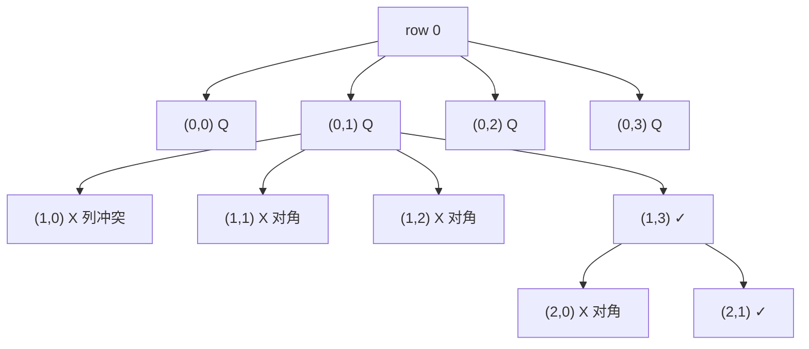

# 0051. N-Queens / N 皇后

!!! info "Meta"
    - **Difficulty**: Hard
    - **Tags**: Backtracking, Board, Recursion · 回溯, 棋盘, 递归
    - **Link**: [LeetCode](https://leetcode.com/problems/n-queens/)
    - **Status**: ✅ Solved
    - **Reviewed**: ☐ ☐ ☐

## Problem

**EN**: Place `n` queens on an `n × n` chessboard so that no two queens attack each other (same row, column, or diagonal). Return all distinct solutions, each as `n` strings of length `n` with `'Q'` and `'.'`.

**中文**: 把 `n` 个皇后放在 `n × n` 棋盘上, 使任意两个皇后都不在同行/同列/同斜线. 返回所有合法解, 每解是 `n` 条长度 `n` 的字符串, `'Q'` 表示皇后, `'.'` 表示空格.

## 思路

### Core idea

**每行只放一个皇后** → 把 2D 问题降成"按行往下走, 每行选哪列". for 循环遍历当前行的列, 递归进入下一行. 同 Yang 总结: **for 是列 (这行选哪格), recurse 是下一行**.

放之前 `isValid(row, col)` 只查**上方**: 同列向上, 左上斜, 右上斜. 下方还没放, 同行只放一个, 都不用查.

`row == n` 时整张棋盘填完, 收果实 (整个 `board` 快照).

### Key Insights

1. **逐行放 = 自动消除"同行" 冲突 / Row-by-row eliminates one constraint**

    一次 dfs 一行, for 循环挑这行的列. 同行多于一个皇后**根本写不出来** — 因为我们一行最多就 push 一次. 剩下要查的只有"同列 / 两个对角线".

    这就是"看似 2D 实际 1D" 的关键. 不做这个简化, 一上来就 `dfs(board)` 在所有空格里随便选, 状态空间多一个数量级.

2. **只查上方 / Only check what's above**

    因为是逐行往下放:

    - **同列向上**: `for i in [0, row): board[i][col]`.
    - **左上斜**: `i--, j--` 同时.
    - **右上斜**: `i--, j++` 同时.

    不查左、右 (同行根本没第二个 Q), 不查下方 (还没放). 整个 isValid 就这三个 for, O(row) ≤ O(n).

3. **board 显式回溯 / 2D-cell push/pop**

    ```cpp
    board[row][col] = 'Q';
    backtrack(board, row + 1, n);
    board[row][col] = '.';
    ```
    跟所有显式回溯模板一样 (同 [0040](../0040-combination-sum-ii/README.md) / [0046](../0046-permutations/README.md) 的 path push/pop), 只是改的是 2D 单元. board 是引用共享, 不是每层拷贝.

4. **进阶: 用三个 bool 数组替代 isValid / O(1) per check**

    ```
    cols[col]            // 列占用
    diag1[row + col]     // ↘ 对角线 id (主对角)
    diag2[row - col + n] // ↗ 对角线 id (副对角)
    ```
    每次 isValid 从 O(n) 降到 O(1), 整体 O(n!·n) → O(n!). N ≤ 9 时不必, 但 N ≥ 14 (变体题) 必须. **是 N-Queens 题面试的标准 follow-up**.

5. **`vector<string> board(n, string(n, '.'))` 一行构造 / Compact init**

    Yang flagged 的小语法: 第一个参数 `n` 是行数, 第二个 `string(n, '.')` 是每行的初值 (长度 n 全 '.'). 等价 `vector<vector<char>>`, 但 string 可以直接 `push_back` 进 res, 省一步转换.

6. **0052 只数解, 不返回 / Variant**

    [0052 N-Queens II](待补) 只问"有多少解", 不需返回. 改 `int count` 累加即可, 跟 0046/0078 的"答案数量" 关系类似. 别用 DP — 没有重叠子问题.

### 一句话总结

**逐行放皇后, for 选列, dfs 下一行. isValid 只查上方 (同列 / 左上斜 / 右上斜). 显式回溯 'Q' / '.' 切换. row == n 收快照.**

### 图解

`n = 4` 的部分决策树:



每一层 row, for 循环试 n 个列, isValid 砍掉不合法. 一条到达 `row == n` 的路径就是一个解.

## Solution

=== "C++"
    ```cpp
    class Solution {
    public:
        vector<vector<string>> res;
        bool isValid(vector<string>& board, int row, int col, int n) {
            for (int i = 0; i < row; i++)                                    // 同列向上
                if (board[i][col] == 'Q') return false;
            for (int i = row - 1, j = col - 1; i >= 0 && j >= 0; i--, j--)   // 左上斜
                if (board[i][j] == 'Q') return false;
            for (int i = row - 1, j = col + 1; i >= 0 && j < n;  i--, j++)   // 右上斜
                if (board[i][j] == 'Q') return false;
            return true;
        }
        void backtrack(vector<string>& board, int row, int n) {
            if (row == n) {                                                  // 整棋盘填完
                res.push_back(board);
                return;
            }
            for (int col = 0; col < n; col++) {                              // for 是列
                if (!isValid(board, row, col, n)) continue;
                board[row][col] = 'Q';
                backtrack(board, row + 1, n);                                // recurse 是下一行
                board[row][col] = '.';                                       // 撤
            }
        }
        vector<vector<string>> solveNQueens(int n) {
            vector<string> board(n, string(n, '.'));                         // n 行 × n 列 全 '.'
            backtrack(board, 0, n);
            return res;
        }
    };
    ```

=== "Python"
    ```python
    class Solution:
        def solveNQueens(self, n: int) -> list[list[str]]:
            res = []
            board = [['.'] * n for _ in range(n)]                            # list of char list, 后面 ''.join 拼成 string
            def is_valid(row: int, col: int) -> bool:
                for i in range(row):                                         # 同列向上
                    if board[i][col] == 'Q': return False
                i, j = row - 1, col - 1
                while i >= 0 and j >= 0:                                     # 左上斜
                    if board[i][j] == 'Q': return False
                    i -= 1; j -= 1
                i, j = row - 1, col + 1
                while i >= 0 and j < n:                                      # 右上斜
                    if board[i][j] == 'Q': return False
                    i -= 1; j += 1
                return True
            def backtrack(row: int):
                if row == n:
                    res.append([''.join(r) for r in board])                  # 每行 ''.join 转 string
                    return
                for col in range(n):
                    if not is_valid(row, col):
                        continue
                    board[row][col] = 'Q'
                    backtrack(row + 1)
                    board[row][col] = '.'
            backtrack(0)
            return res
    ```

=== "JavaScript"
    ```javascript
    /**
     * @param {number} n
     * @return {string[][]}
     */
    var solveNQueens = function(n) {
        const res = [];
        // Array.from(...) 创建 n 个独立 row, 每行用 Array(n).fill('.') 平铺 n 个 '.'
        // 不用 Array(n).fill(Array(n).fill('.')) — 那样所有行是同一个引用, 改一处全变!
        const board = Array.from({length: n}, () => Array(n).fill('.'));
        const isValid = (row, col) => {
            for (let i = 0; i < row; i++)
                if (board[i][col] === 'Q') return false;
            for (let i = row - 1, j = col - 1; i >= 0 && j >= 0; i--, j--)
                if (board[i][j] === 'Q') return false;
            for (let i = row - 1, j = col + 1; i >= 0 && j < n;  i--, j++)
                if (board[i][j] === 'Q') return false;
            return true;
        };
        const backtrack = (row) => {
            if (row === n) {
                res.push(board.map(r => r.join('')));                        // 每行 join 转 string
                return;
            }
            for (let col = 0; col < n; col++) {
                if (!isValid(row, col)) continue;
                board[row][col] = 'Q';
                backtrack(row + 1);
                board[row][col] = '.';
            }
        };
        backtrack(0);
        return res;
    };
    ```

### 进阶: 三个 bool 数组替代 isValid (O(1) 查)

```cpp
vector<bool> cols(n), d1(2*n), d2(2*n);                  // d1: row+col, d2: row-col+n
// for col 内:
if (cols[col] || d1[row + col] || d2[row - col + n]) continue;
cols[col] = d1[row + col] = d2[row - col + n] = true;
board[row][col] = 'Q';
backtrack(row + 1);
board[row][col] = '.';
cols[col] = d1[row + col] = d2[row - col + n] = false;
```
N ≤ 9 用不上, 但更大棋盘 (变体题) 必须. **N-Queens 面试常见 follow-up**.

## Complexity

- **Time**: O(n!·n) — n! 上界 (每行选一列, 剪枝后远小), 每次 isValid O(n). 三数组版降到 O(n!).
- **Space**: O(n²) board + O(n) recursion + O(解数 × n²) 输出.

## 易错点

- **`board[row][col] = '.'` 撤记号不能漏**: 漏了上一个皇后永久占位, 后续兄弟分支全废. 同所有显式回溯的 pop 必做.
- **JS 创建二维数组别 `Array(n).fill(Array(n).fill('.'))`**: 那样 n 行是**同一引用**, 改一行所有行都变. 必须 `Array.from({length: n}, () => Array(n).fill('.'))` 或类似让每行独立.

## 相关题目

- [0046. Permutations](../0046-permutations/README.md) — 同款"用 used[] 排除同列" 的思想 (N-Queens 也可写成"行 = 排列, used[col] 标记")
- [0040. Combination Sum II](../0040-combination-sum-ii/README.md) — 同款显式回溯 + 进入/退出对偶
- [0078. Subsets](../0078-subsets/README.md) — 回溯模板基础
- [0052. N-Queens II](../0052-n-queens-ii/README.md) — 只数解的版本, 改 `int count` 累加
- [0037. Sudoku Solver](../0037-sudoku-solver/README.md) — 9×9 棋盘填数, 同款"逐格 + 三方向冲突检查 + 显式回溯"; 输出语义对照 (void vs bool 短路)
- [0301. Remove Invalid Parentheses](../0301-remove-invalid-parentheses/README.md) — 字符串版回溯 + 剪枝
- 0079\. Word Search (待补) — 2D 棋盘搜索字符串, 同款 visited[][] + 4 方向 dfs
