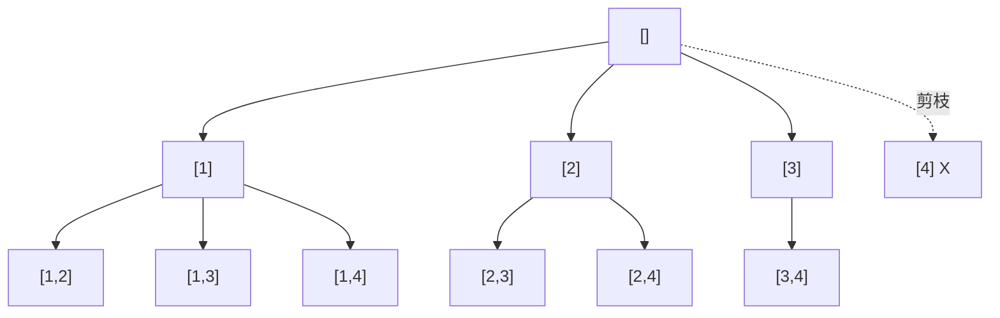

# 0077. Combinations / 组合

!!! info "Meta"
    - **Difficulty**: Medium
    - **Tags**: Backtracking, Combinations · 回溯, 组合
    - **Link**: [LeetCode](https://leetcode.com/problems/combinations/)
    - **Status**: ✅ Solved
    - **Reviewed**: ☐ ☐ ☐

## Problem

**EN**: Given `n` and `k`, return all possible **combinations** of `k` numbers chosen from `[1, n]` (order doesn't matter).

**中文**: 给 `n` 和 `k`, 返回 `[1, n]` 中所有可能的 `k` 个数的**组合** (无序).

## 思路

### Core idea

回溯三件套: **选 → 走 → 退**.

- 维护 `path` 当前正在攒的组合, `startIndex` 表示"下一个候选只能从这里开始往后选" (保证无序去重).
- for 循环试每个可选数: push 进 path → 递归 → pop 出来撤销.
- 当 `path.size() == k` 就把当前 path 快照拷贝进 res, return.

### Key Insights

1. **显式回溯模板 = [0113](../../07-binary-tree/0113-path-sum-ii/README.md) 的同款骨架 / Same template as Path Sum II**

    ```
    void backtrack(state) {
        if (满足终止条件) { 收果实; return; }
        for (每个候选 c) {
            选 c;             // path.push_back(c)
            backtrack(...);   // 进下一层
            撤销 c;            // path.pop_back()
        }
    }
    ```
    回溯系列的所有题都是这个壳, 只换"候选集合是什么 / 终止条件是什么 / 怎么收果实". 0077 是这个家族里**最干净的入门**, 因为状态只有 `(path, startIndex)`.

2. **`startIndex` 是组合 (无序) 的关键 / startIndex avoids order duplicates**

    | 类型 | 怎么防重 | 例子 |
    |---|---|---|
    | **组合** (本题) | `startIndex` 单向往后选 | `[1,2]` 跟 `[2,1]` 算同一种 → 只生成 `[1,2]` |
    | **排列** (0046 待补) | `used[]` 数组 | `[1,2]` 跟 `[2,1]` 是两种 → 都要生成 |
    | **子集** (0078 待补) | `startIndex` + 每个节点都收果实 | 包含组合, 但所有 path.size() 都算答案 |

    一句话: **无序 → startIndex; 有序 → used[]**.

3. **剪枝: `i <= n - (k - path.size()) + 1` / Prune loop bound**

    经典优化, 必须会:

    - 还需要 `need = k - path.size()` 个数.
    - 剩下能选的范围 `[i, n]`, 数量 `n - i + 1`. 要满足 `n - i + 1 >= need`, 化简: `i <= n - need + 1`.
    - 起点超过这个的 i 注定凑不齐 k 个, 直接砍掉子树.

    不剪也能过 LC, 但回溯题**面试常被问"还能不能剪"** — 这是标准答案.

4. **回溯 = 决策树的 DFS / Backtracking = DFS on a decision tree**

    虽然没有显式的 tree 数据结构, 但每次 for 循环的每个选择就是树的一个分支, 整棵 "搜索树" 就在递归中被走出. 0113 那种"DFS 在真二叉树上"和这种"DFS 在虚拟决策树上"本质一样 — **path push/pop 模式完全相同**.

5. **结果拷贝快照同 0113 / Snapshot copy gotcha**

    `res.push_back(path)` C++ 默认拷贝, 没事. Python 用 `path[:]`, JS 用 `[...path]`. 不拷贝就会得到一堆指向同一个空 path 的引用 — 跟 [0113 易错点](../../07-binary-tree/0113-path-sum-ii/README.md#易错点) 同一个坑.

### 一句话总结

**for 循环穷举 + startIndex 防重 + path push/pop 显式回溯, 攒满 k 个就收快照. 剪枝看"剩余空间够不够".**

### 图解

`n=4, k=2` 的决策树:



`[4]` 那条剪掉是因为 path.size()=1, 还需 1 个, `i <= 4 - 1 + 1 = 4` 是边界, 实际选 4 后 [5,4] 空了 — 边界处刚好剪.

## Solution

=== "C++"
    ```cpp
    class Solution {
    public:
        vector<vector<int>> res;
        vector<int> path;
        void backtracking(int n, int k, int startIndex) {
            if ((int)path.size() == k) {
                res.push_back(path);
                return;
            }
            // 剪枝: 起点最远到 n - (k - path.size()) + 1
            for (int i = startIndex; i <= n - (k - (int)path.size()) + 1; i++) {
                path.push_back(i);
                backtracking(n, k, i + 1);
                path.pop_back();
            }
        }
        vector<vector<int>> combine(int n, int k) {
            backtracking(n, k, 1);
            return res;
        }
    };
    ```

=== "Python"
    ```python
    class Solution:
        def combine(self, n: int, k: int) -> list[list[int]]:
            res, path = [], []
            def backtrack(start: int):
                if len(path) == k:
                    res.append(path[:])               # path[:] 切片拷贝快照, 同 0113
                    return
                # range(start, n - (k - len(path)) + 2) 上界 +2 因为 range 右开
                for i in range(start, n - (k - len(path)) + 2):
                    path.append(i)
                    backtrack(i + 1)
                    path.pop()
            backtrack(1)
            return res
    ```

=== "JavaScript"
    ```javascript
    /**
     * @param {number} n
     * @param {number} k
     * @return {number[][]}
     */
    var combine = function(n, k) {
        const res = [], path = [];
        const backtrack = (start) => {
            if (path.length === k) {
                res.push([...path]);                  // 扩展运算符浅拷贝快照
                return;
            }
            // 剪枝: 起点上界
            const upper = n - (k - path.length) + 1;
            for (let i = start; i <= upper; i++) {
                path.push(i);
                backtrack(i + 1);
                path.pop();
            }
        };
        backtrack(1);
        return res;
    };
    ```

## Complexity

- **Time**: O(C(n, k) × k) — 一共生成 C(n,k) 个组合, 每个长度 k, 拷贝快照 O(k).
- **Space**: O(k) recursion + path 长 k. 输出本身 O(C(n,k) × k).

## 易错点

- **剪枝边界的 `+1` 不要丢**: `i <= n - (k - path.size()) + 1`. 漏 `+1` 会丢掉一些合法组合 (例如 `n=4, k=2` 的 `[3,4]`).
- **path 拷贝 vs 引用**: 同 [0113 易错点](../../07-binary-tree/0113-path-sum-ii/README.md) 的坑. C++ vector push_back 自动拷贝; Python/JS 必须显式拷贝.
- **startIndex 是 `i + 1` 不是 `startIndex + 1`**: 下一层从当前选的数**之后**开始, 不是从外层 startIndex 往后. 写错会重复生成像 `[1,1]` 这种 (其实组合不允许同数).
- **`int` 比较 `path.size()` 在 C++ 里要 cast**: `path.size()` 是 `size_t` (unsigned), `k` 是 int. 表达式 `k - path.size()` 在 path.size() > k 时会下溢成巨大正数. Yang 的代码因为 `path.size() == k` 时已经 return 了, 没踩到这个坑, 但谨慎一点 cast 到 int 更安全.
- **题目从 1 开始, 不是 0**: `backtracking(n, k, 1)` 入口 startIndex = 1. 写成 0 会把 0 也算进答案.
- **不要试图记忆化**: 回溯每条路径都是独立答案, 没有"重叠子问题" — DP / memo 不适用. 这跟 DP 是泾渭分明的两条线.

## 相关题目

- [0113. Path Sum II](../../07-binary-tree/0113-path-sum-ii/README.md) — 同款显式回溯模板, 走在真二叉树上 (本题走在虚拟决策树上)
- [0257. Binary Tree Paths](../../07-binary-tree/0257-binary-tree-paths/README.md) — 同款收集路径, 但用隐式回溯 (string 按值传)
- [0216. Combination Sum III](../0216-combination-sum-iii/README.md) — 0077 + 和等于 target 的约束, 范围固定 [1,9]
- 0046. Permutations (待补) — 排列版, 用 `used[]` 代替 `startIndex`
- 0078. Subsets (待补) — 子集版, 每个节点都收果实 (不只是 `size == k` 才收)
- 0039. Combination Sum (待补) — 允许重复选, `recurse(i)` 不是 `recurse(i+1)`
- 0040. Combination Sum II (待补) — 同一层去重的经典坑
