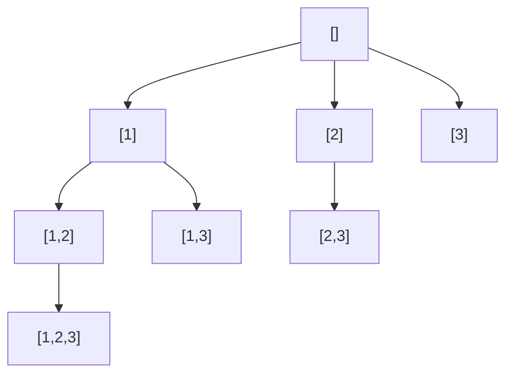

# 0078. Subsets / 子集

!!! info "Meta"
    - **Difficulty**: Medium
    - **Tags**: Backtracking, Array, Bitmask · 回溯, 数组, 位运算
    - **Link**: [LeetCode](https://leetcode.com/problems/subsets/)
    - **Status**: ✅ Solved
    - **Reviewed**: ☐ ☐ ☐

## Problem

**EN**: Given a set of **distinct** integers `nums`, return all possible **subsets** (the power set). Order within a subset doesn't matter; the result must not contain duplicate subsets.

**中文**: 给一组**互不相同**的整数 `nums`, 返回所有可能的子集 (幂集). 子集内顺序不限; 结果不能有重复子集.

## 思路

### Core idea

回溯三件套不变, **唯一改动**: `res.push_back(path)` 放在每次递归**入口**, 不再加 "path 满了才收" 的判断. 决策树上**每一个节点 (= path 的一个快照) 就是一个子集**, 一共 2^n 个.

### Key Insights

1. **回溯系列的"收果实时机"三种 / Three timings for harvesting**

    | 题型 | 收果实时机 | 候选 |
    |---|---|---|
    | [0077](../0077-combinations/README.md) / [0216](../0216-combination-sum-iii/README.md) 组合 | `path.size() == k` 才收 | startIndex 推进 |
    | [0039](../0039-combination-sum/README.md) / [0040](../0040-combination-sum-ii/README.md) 组合和 | `curSum == target` 才收 | startIndex (+ 同层去重) |
    | **0078 子集 (本题)** | **每个节点都收** | startIndex 推进 |

    一句话: **子集 = "所有 size 的组合的并集"**. 0077 收的是某一层, 0078 收所有层 → 把 collect 从 if 块挪到函数入口即可.

2. **for 循环自然终止 = 无需显式 return / Empty loop is the base case**

    `start == n` 时 for 不执行, 函数自然返回. 不必写 `if (start == n) return` — 写了也没错, 但是冗余的 (`return` 本来就是 fall-through 自动加的).

3. **决策树 2^n 节点对应 2^n 子集 / Decision tree size = power-set size**

    每个元素只有"选 / 不选"两种状态, 子集总数 2^n. 决策树高度 n, 每个节点都贡献一个子集. 全收即得幂集.

    > 注意是**节点**, 不是叶子. 跟 0077 (只收叶子) 区别在这里.

4. **进阶: 位运算枚举 (无栈版) / Bitmask enumeration**

    n ≤ 20 时, 直接 for `mask = 0..(1<<n)-1`, 把 `mask` 的二进制每位对应 `nums[i]` 取/不取:
    ```cpp
    for (int mask = 0; mask < (1 << n); ++mask) {
        vector<int> sub;
        for (int i = 0; i < n; ++i)
            if (mask & (1 << i)) sub.push_back(nums[i]);
        res.push_back(sub);
    }
    ```
    O(n × 2^n), 无递归更紧凑. **不过教学价值不如回溯模板** — 学回溯就坚持回溯写法.

### 一句话总结

**`res.push_back(path)` 放在每次入口, 决策树每个节点都是一个子集, 共 2^n 个. 回溯模板其它不动.**

### 图解

`nums = [1,2,3]` 的决策树, 每个节点都是答案:



共 8 = 2³ 个节点, 全收: `[]`, `[1]`, `[2]`, `[3]`, `[1,2]`, `[1,3]`, `[2,3]`, `[1,2,3]`.

## Solution

=== "C++"
    ```cpp
    class Solution {
    public:
        vector<vector<int>> res;
        vector<int> path;
        void backtrack(vector<int>& nums, int start) {
            res.push_back(path);                              // 每个节点都收
            for (int i = start; i < (int)nums.size(); i++) {
                path.push_back(nums[i]);
                backtrack(nums, i + 1);
                path.pop_back();
            }
        }
        vector<vector<int>> subsets(vector<int>& nums) {
            backtrack(nums, 0);
            return res;
        }
    };
    ```

=== "Python"
    ```python
    class Solution:
        def subsets(self, nums: list[int]) -> list[list[int]]:
            res, path = [], []
            def backtrack(start: int):
                res.append(path[:])                           # 每个节点都收快照
                for i in range(start, len(nums)):
                    path.append(nums[i])
                    backtrack(i + 1)
                    path.pop()
            backtrack(0)
            return res
        # 一行 Pythonic: itertools.chain.from_iterable(combinations(nums, r) for r in range(len(nums)+1))
    ```

=== "JavaScript"
    ```javascript
    /**
     * @param {number[]} nums
     * @return {number[][]}
     */
    var subsets = function(nums) {
        const res = [], path = [];
        const backtrack = (start) => {
            res.push([...path]);                              // 浅拷贝快照
            for (let i = start; i < nums.length; i++) {
                path.push(nums[i]);
                backtrack(i + 1);
                path.pop();
            }
        };
        backtrack(0);
        return res;
    };
    ```

## Complexity

- **Time**: O(n × 2^n) — 2^n 个子集, 每个拷贝最长 n.
- **Space**: O(n) recursion + path. 输出本身 O(n × 2^n).

## 易错点

- **`res.push_back(path)` 必须在函数入口, 不在 for 内**: 漏到 for 里只能收"非空子集", 空集 `[]` 会丢. 入口收保证 0-长度也算一个.
- **不要加 "path.size() == n 才收" 的条件**: 那是 0077 (组合) 的语义, 不是子集. 子集要所有 size 都收.

## 相关题目

- [0077. Combinations](../0077-combinations/README.md) — 同 startIndex 模板, 但只收 `size == k` 那层
- [0040. Combination Sum II](../0040-combination-sum-ii/README.md) — 同层去重思路, 0090 子集 II 直接套
- [0017. Letter Combinations of a Phone Number](../0017-letter-combinations-of-a-phone-number/README.md) — 同回溯模板, 不同决策树形态
- 0090. Subsets II (待补) — nums 有重复, 加同层去重 (套 0040 思路)
- 0491. Non-decreasing Subsequences (待补) — 类似子集, 但不能 sort → 用 unordered_set 同层去重
- 0784. Letter Case Permutation (待补) — 同款"每层一个二选一", 每个节点都是答案
