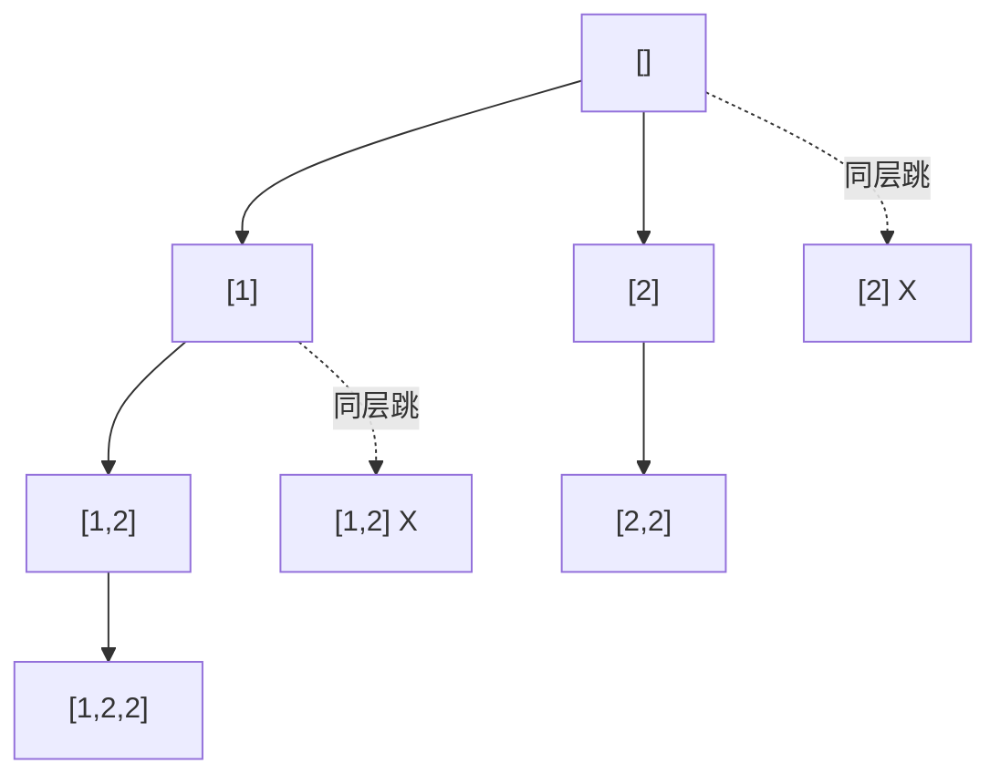

# 0090. Subsets II / 子集 II

!!! info "Meta"
    - **Difficulty**: Medium
    - **Tags**: Backtracking, Array, Sort · 回溯, 数组, 排序
    - **Link**: [LeetCode](https://leetcode.com/problems/subsets-ii/)
    - **Status**: ✅ Solved
    - **Reviewed**: ☐ ☐ ☐

## Problem

**EN**: Given an array `nums` that **may contain duplicates**, return all possible **unique** subsets. The solution set must not contain duplicate subsets.

**中文**: 给一个**可能有重复值**的数组 `nums`, 返回所有可能的**不同**子集. 结果中不允许有重复子集.

## 思路

### Core idea

**[0078 子集](../0078-subsets/README.md) + [0040 同层去重](../0040-combination-sum-ii/README.md)**. 两条改动直接组合:

1. 入口 `sort(nums)` — 让相同值挨在一起.
2. for 循环里加一行 `if (i > start && nums[i] == nums[i-1]) continue;` — 同层同值跳过.

回溯三件套和"每个节点都收" 一字不改.

### Key Insights

1. **0078 + 0040 = 0090 / Compose two patterns**

    模式很清晰: 子集骨架 (来自 0078) + 同层去重补丁 (来自 0040). 两题各自的知识点早就有了, 0090 只是把它们拧在一起.

    > 这就是回溯系列的快感: 一旦把每个轴 (收果实时机 / 去重机制 / 候选生成) 学清楚, 新题就是几条已有补丁的叠加.

2. **完成回溯系列的"基础四宫格" / Completes the foundation 2×2**

    | | 元素唯一 | 元素有重 (sort + 同层去重) |
    |---|---|---|
    | **组合** (size==k 才收) | [0077](../0077-combinations/README.md) | [0040](../0040-combination-sum-ii/README.md) (+ sum 约束) |
    | **子集** (每个节点都收) | [0078](../0078-subsets/README.md) | **0090 (本题)** |

    剩余的轴是"是否有重复"和"是否计 size==k". 任意组合都对应一道题.

3. **"树枝同值留, 树层同值跳" 口诀 / The dedup mantra**

    同 [0040 Insight 2](../0040-combination-sum-ii/README.md): `i > start` 锁定"同层兄弟", 排除"同支祖先". 写成 `i > 0` 会一并禁掉 `[1,1]` 这种从有重数组里取多个相同值的合法子集.

4. **复杂度上界 O(n × 2^n) 同 0078 / Same complexity ceiling**

    Sort 一次 O(n log n) 但被 2^n 节点拷贝压住. 同层去重剪掉的是重复 path 的整个子树, **越多重复值压得越狠** — 实际答案数 ≤ 2^n, 通常小很多.

### 一句话总结

**0078 子集模板 + 入口 sort + `i > start && nums[i] == nums[i-1]` 跳同层同值. 树枝同值留, 树层同值跳.**

### 图解

`nums = [1, 2, 2]` 排序后 `[1, 2, 2]` 的决策树:



答案 6 个: `[]`, `[1]`, `[2]`, `[1,2]`, `[2,2]`, `[1,2,2]`. 同层第二个 `2` 整棵子树被剪.

## Solution

=== "C++"
    ```cpp
    class Solution {
    public:
        vector<vector<int>> res;
        vector<int> path;
        void backtrack(vector<int>& nums, int start) {
            res.push_back(path);                                           // 每个节点都收 (= 0078)
            for (int i = start; i < (int)nums.size(); i++) {
                if (i > start && nums[i] == nums[i - 1]) continue;         // 同层同值: 跳 (= 0040)
                path.push_back(nums[i]);
                backtrack(nums, i + 1);
                path.pop_back();
            }
        }
        vector<vector<int>> subsetsWithDup(vector<int>& nums) {
            sort(nums.begin(), nums.end());                                // 必须排序: 同层去重依赖
            backtrack(nums, 0);
            return res;
        }
    };
    ```

=== "Python"
    ```python
    class Solution:
        def subsetsWithDup(self, nums: list[int]) -> list[list[int]]:
            nums.sort()                                                    # in-place 排序
            res, path = [], []
            def backtrack(start: int):
                res.append(path[:])                                         # 每个节点都收快照
                for i in range(start, len(nums)):
                    if i > start and nums[i] == nums[i - 1]:
                        continue                                           # 同层去重
                    path.append(nums[i])
                    backtrack(i + 1)
                    path.pop()
            backtrack(0)
            return res
    ```

=== "JavaScript"
    ```javascript
    /**
     * @param {number[]} nums
     * @return {number[][]}
     */
    var subsetsWithDup = function(nums) {
        nums.sort((a, b) => a - b);                                        // 数字排序必须给 compareFn (字典序默认会出错)
        const res = [], path = [];
        const backtrack = (start) => {
            res.push([...path]);
            for (let i = start; i < nums.length; i++) {
                if (i > start && nums[i] === nums[i - 1]) continue;        // 同层去重
                path.push(nums[i]);
                backtrack(i + 1);
                path.pop();
            }
        };
        backtrack(0);
        return res;
    };
    ```

## Complexity

- **Time**: O(n × 2^n) 上界 — sort O(n log n) 被节点拷贝压住, 实际有重时远小于 2^n.
- **Space**: O(n) recursion + path.

## 易错点

- **必须 `sort`**: 不排序 `nums[i] == nums[i-1]` 检测不到分散的相同值. 整棵决策树会大量产出重复子集.
- **`i > start` 不是 `i > 0`**: 同 0040 的核心坑. 写成 `i > 0` 会一并禁掉同 path 内的合法相同值, 比如 `[2,2]`.

## 相关题目

- [0078. Subsets](../0078-subsets/README.md) — 元素唯一版, 本题去掉 sort + dedup 就是它
- [0040. Combination Sum II](../0040-combination-sum-ii/README.md) — 同款"同层去重"补丁, 加在组合上而非子集上
- [0077. Combinations](../0077-combinations/README.md) — 子集系列的"size==k 限制版"
- [0491. Non-decreasing Subsequences](../0491-non-decreasing-subsequences/README.md) — 不能 sort (会破坏 subsequence 顺序) → 用 unordered_set 同层去重
- 0046\. Permutations (待补) — 排列版的基础, 用 `used[]` 代替 startIndex
- 0047\. Permutations II (待补) — 排列 + 同层去重, `used[i-1] == false` 形式的另一种写法
