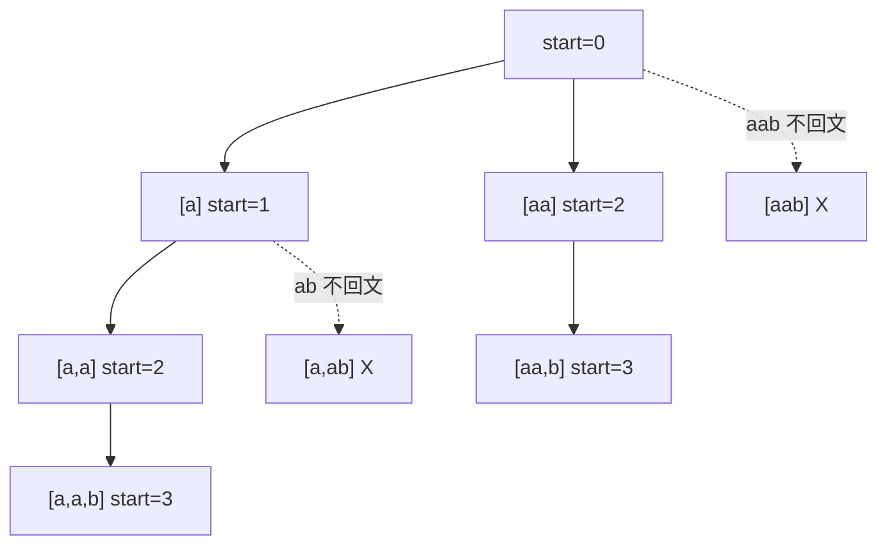

# 0131. Palindrome Partitioning / 分割回文串

!!! info "Meta"
    - **Difficulty**: Medium
    - **Tags**: Backtracking, String, Palindrome · 回溯, 字符串, 回文
    - **Link**: [LeetCode](https://leetcode.com/problems/palindrome-partitioning/)
    - **Status**: ✅ Solved
    - **Reviewed**: ☐ ☐ ☐

## Problem

**EN**: Partition string `s` such that every substring of the partition is a palindrome. Return **all** possible partitions.

**中文**: 把字符串 `s` 切成若干段, 使每段都是回文. 返回所有可能的切法.

## 思路

### Core idea

**切割 = 组合**. `start` 是当前要切的起点, for 循环里 `end` 在 `[start, n-1]` 滑动, 每个 `end` 就是一个候选 "下一段切到这里". 是回文就 push slice → 递归到 `end + 1` → pop. `start == s.size()` 表示"切完了", 收果实.

### Key Insights

1. **切割 = 组合, 同款 startIndex 推进 / Partition is just combination**

    把"在 `[start, n-1]` 选哪个 end 作为切口" 看成"在候选集合里选一个", `start` 推进就跟 [0077](../0077-combinations/README.md) / [0039](../0039-combination-sum/README.md) 的 `startIndex` 完全等价. 终止条件 "切完了" = "path 满了". 骨架原封不动.

2. **三种决策树形态的对照表 / Three decision-tree shapes**

    | 题型 | 候选生成 | level 标记 |
    |---|---|---|
    | [0017](../0017-letter-combinations-of-a-phone-number/README.md) (多集合每位一选) | 不同 digit 的字母 | `idx` 推进 |
    | 0077 / 0039 / 0040 (一集合选若干) | 候选数组下标 | `startIndex` 推进 |
    | **0131 (本题: 一串切若干段)** | `[start, end]` 这一段 | `start` 推进, `end` 在 `[start, n-1]` 试 |

    回溯系列的所有题都是这张表的某个组合 — 知道候选怎么生成 + level 怎么推进, 模板自动套上.

3. **`continue` 跳非回文 vs `if` 嵌套 / Continue-skip is cleaner**

    Yang 选了:
    ```cpp
    if (!isPalindrome(s, start, end)) continue;
    path.push_back(...);
    backtrack(...);
    path.pop_back();
    ```
    比下面这种嵌套写法干净:
    ```cpp
    if (isPalindrome(s, start, end)) {
        path.push_back(...);
        backtrack(...);
        path.pop_back();
    }
    ```
    好处: **push 和 pop 一定紧邻**, 视觉上是一对 — 不会被嵌套层级冲散. 同时也保证将来加更多 guard (e.g. 长度上限) 时不会把回溯三件套拆碎.

4. **回文检查 O(slice_len), 整体 O(n × 2^n) / Complexity**

    - 切法总数: 长度 n 的串有 2^(n-1) 种切法.
    - 每种切法里, 每个 slice 都要查回文 (O(slice_len)). 一条 path 上所有 slice 长度加起来是 n.
    - 总: O(n × 2^n).

    数据 n ≤ 16, 没问题. 但你应该知道这个上界, 因为 [0132 Palindrome Partitioning II](https://leetcode.com/problems/palindrome-partitioning-ii/) (待补) 数据更大就必须上 DP.

5. **进阶: dp 预计算回文表 / Precompute `dp[l][r]`**

    把 `isPalindrome(s, l, r)` 改成查表:
    ```cpp
    // dp[l][r] = 是否回文; 转移: s[l]==s[r] && (r-l<2 || dp[l+1][r-1])
    ```
    预计算 O(n²), 之后查询 O(1). 本题数据小, 不必, 但 0132 / 1278 (Palindrome Partitioning III/IV) 必须. 是"回溯 + DP" 组合的入门姿势.

6. **substr 的拷贝开销 / Slicing cost**

    `s.substr(start, len)` 每次 O(len). 整条 path 上累积 O(n). 数据小不必优化. 极致写法: path 存 `(start, end)` 对, 答案构造时再 substring — 但代码长很多, 收益不大.

### 一句话总结

**切割 = 组合. `start` 推进, `end` 在 `[start, n-1]` 滑. 是回文就 push slice → recurse(end+1) → pop, 不是就 continue. `start == n` 收果实.**

### 图解

`s = "aab"` 的切割决策树:



收 2 个: `["a","a","b"]`, `["aa","b"]`.

## Solution

=== "C++"
    ```cpp
    class Solution {
    public:
        vector<vector<string>> res;
        vector<string> path;
        void backtrack(const string& s, int start) {
            if (start == (int)s.size()) {
                res.push_back(path);
                return;
            }
            for (int end = start; end < (int)s.size(); end++) {
                if (!isPalindrome(s, start, end)) continue;          // 用 continue 保 push/pop 紧邻
                path.push_back(s.substr(start, end - start + 1));    // [start, end] 这一段
                backtrack(s, end + 1);                               // 下一段从 end+1 起
                path.pop_back();
            }
        }
        bool isPalindrome(const string& s, int l, int r) {
            while (l < r) {
                if (s[l] != s[r]) return false;
                ++l; --r;
            }
            return true;
        }
        vector<vector<string>> partition(string s) {
            backtrack(s, 0);
            return res;
        }
    };
    ```

=== "Python"
    ```python
    class Solution:
        def partition(self, s: str) -> list[list[str]]:
            res, path = [], []
            n = len(s)
            def is_palindrome(l: int, r: int) -> bool:
                while l < r:
                    if s[l] != s[r]:
                        return False
                    l += 1
                    r -= 1
                return True
            # 一行版: return s[l:r+1] == s[l:r+1][::-1] — 切片反转比较, 简洁但每次 O(slice_len) 拷贝
            def backtrack(start: int):
                if start == n:
                    res.append(path[:])                              # 快照拷贝
                    return
                for end in range(start, n):
                    if not is_palindrome(start, end):
                        continue
                    path.append(s[start:end + 1])                    # 切片即 substr
                    backtrack(end + 1)
                    path.pop()
            backtrack(0)
            return res
    ```

=== "JavaScript"
    ```javascript
    /**
     * @param {string} s
     * @return {string[][]}
     */
    var partition = function(s) {
        const res = [], path = [];
        const isPalindrome = (l, r) => {
            while (l < r) {
                if (s[l] !== s[r]) return false;
                l++;
                r--;
            }
            return true;
        };
        const backtrack = (start) => {
            if (start === s.length) {
                res.push([...path]);                                 // 扩展运算符浅拷贝
                return;
            }
            for (let end = start; end < s.length; end++) {
                if (!isPalindrome(start, end)) continue;
                path.push(s.slice(start, end + 1));                  // s.slice 等价 C++ substr
                backtrack(end + 1);
                path.pop();
            }
        };
        backtrack(0);
        return res;
    };
    ```

### 进阶: 预计算 dp 回文表

```cpp
// O(n²) 预算, O(1) 查询. 本题数据小可省, 0132 等数据大题必须开
int n = s.size();
vector<vector<bool>> dp(n, vector<bool>(n, false));
for (int l = n - 1; l >= 0; --l) {
    for (int r = l; r < n; ++r) {
        if (s[l] == s[r] && (r - l < 2 || dp[l + 1][r - 1])) dp[l][r] = true;
    }
}
// 然后回溯里 isPalindrome(l, r) 替换成 dp[l][r]
```

## Complexity

- **Time**: O(n × 2^n) — 2^(n-1) 切法 × 每条 path 累计回文检查 O(n).
- **Space**: O(n) recursion + path. 输出本身 O(答案数 × 平均段长).

## 易错点

- **`backtrack(s, end + 1)` 不是 `start + 1`**: 下一段从**当前段的结尾之后**开始, 不是 start 之后. 写错会切错地方, 所有答案错位.
- **`start == s.size()` 是终止条件不是 `start == s.size() - 1`**: 当 start 越过末尾, 整串切完. `size() - 1` 还差最后一字符没处理.
- **`s.substr(start, end - start + 1)`, 第二个参数是 length 不是 end**: C++ substr 的接口是 `(pos, count)`. 别写成 `s.substr(start, end)`.
- **回文检查的 l/r 都包含**: 闭区间 [l, r]. while 条件 `l < r` 即可, `l == r` 时是单字符自然回文.
- **Python `s[l:r+1] == s[l:r+1][::-1]` 看起来香, 实际开销不小**: 切片每次都拷贝, 然后反转再拷贝. 整体 O(slice_len) 加倍. 自己写两指针更稳, 但 Python 一行版面试可以亮一手.
- **path 拷贝快照**: 同其它回溯, Python/JS 要显式 `[:]` / `[...]`.

## 相关题目

- [0077. Combinations](../0077-combinations/README.md) — 同款 startIndex 模板, "选 candidate" 换成 "选切口"
- [0039. Combination Sum](../0039-combination-sum/README.md) — 同款回溯三件套, 单集合多选
- [0040. Combination Sum II](../0040-combination-sum-ii/README.md) — 同款回溯, 候选有重复要去重
- [0017. Letter Combinations of a Phone Number](../0017-letter-combinations-of-a-phone-number/README.md) — 同回溯模板, 不同形态 (多集合每位一选)
- [0093. Restore IP Addresses](../0093-restore-ip-addresses/README.md) — 切割问题同模板, 每段有更严的合法性约束 (IP 段 + 必须 4 段)
- 0132\. Palindrome Partitioning II (待补) — 求最少切几刀, 必须上 DP
- 0647\. Palindromic Substrings (待补) — 数有多少回文子串, 同款回文检测但不切
- 0005\. Longest Palindromic Substring (待补) — 最长回文子串, 经典 DP / 中心扩散
