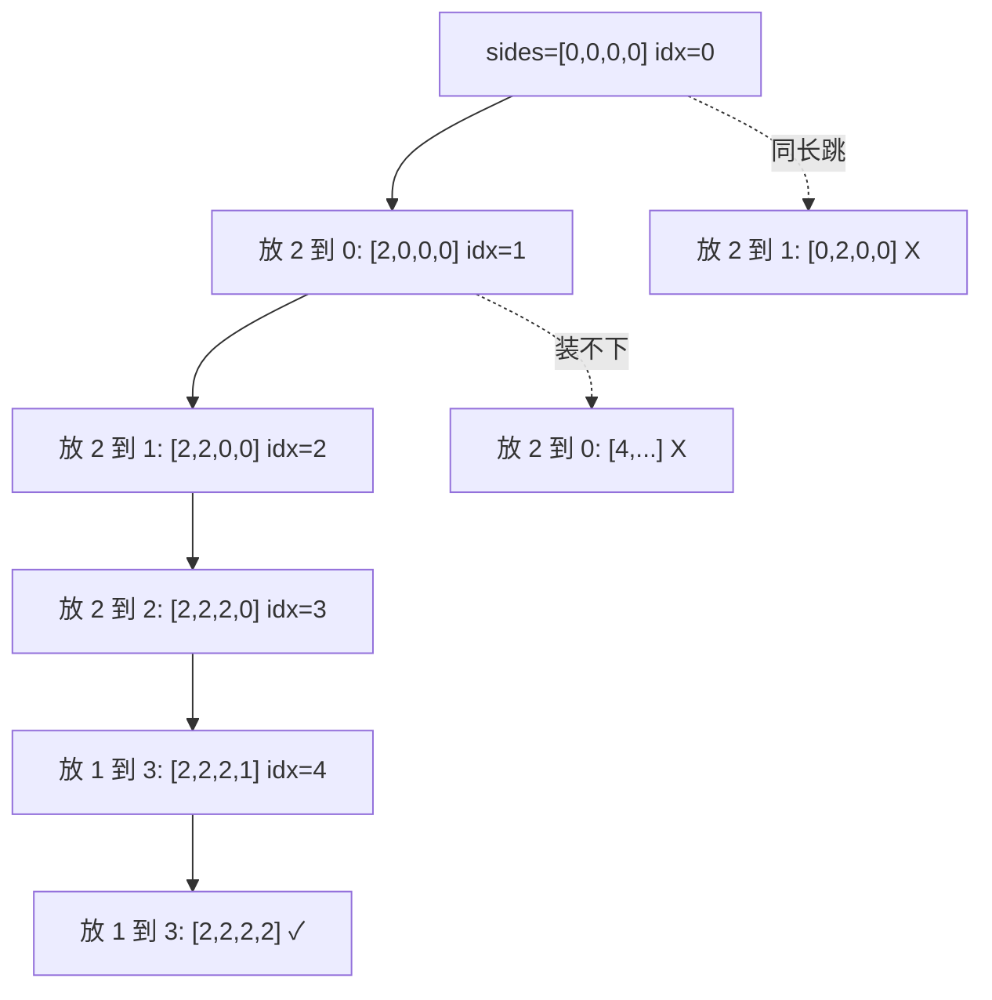

# 0473. Matchsticks to Square / 火柴拼正方形

!!! info "Meta"
    - **Difficulty**: Hard
    - **Tags**: Backtracking, Bit Manipulation, DP · 回溯, 位运算, 动态规划
    - **Link**: [LeetCode](https://leetcode.com/problems/matchsticks-to-square/)
    - **Status**: ✅ Solved
    - **Reviewed**: ☐ ☐ ☐

## Problem

**EN**: Given an array of matchstick lengths, determine if you can use **all** sticks to form a square (each stick used exactly once, can't break sticks).

**中文**: 给一组火柴长度, 判断能否用**全部**火柴拼成一个正方形 (每根用且仅用一次, 不能折断).

## 思路

### Core idea

**把每根火柴放到 4 条边之一**, 让 4 边都等于 `total / 4`.

1. **预过滤**: `total % 4 != 0` → false. 不能均分必失败.
2. **降序 sort**: 大棒先放, 不合适早砍枝.
3. **回溯**: 决策树深度 = 火柴数, 每个节点试 4 条边.
4. **两道剪枝** (这题灵魂):
   - `sides[i] + len > target` → 这条边装不下, 跳.
   - `i > 0 && sides[i] == sides[i-1]` → 4 边里有等长的, 放到第一个等长边上和放到第二个等价, 跳.
5. **bool 短路**: 任一路径成功立即一路 return true.

### Key Insights

1. **"放 n 个物品到 k 个桶" 的通用模板 / Place-into-k-bins**

    回溯系列的另一形态: 状态是 `(idx, sides[k])`, 每个 idx 在 k 个桶里选一个放. 同款应用:

    - **0473 (本题)** k = 4 (正方形 4 边).
    - 0698 Partition to K Equal Sum Subsets (待补) — k 任意.
    - 1723 Find Minimum Time to Finish All Jobs (待补) — k 个工人, 求最大负载最小化.

    都共享"按物品深度推进 + 每层选桶 + bool/最优值短路" 骨架.

2. **降序 sort 是这题的"高 ROI 剪枝" / Descending sort prunes massively**

    升序: 小棒先放怎么放都"看似 OK", 直到最后一根大棒发现剩余空间不够 — 才回溯, 浪费海量分支.

    降序: 大棒先, 装不下立即 `sides[i] + len > target` 砍. 越早探测失败越省时间.

    这是回溯题里**最高 ROI 的一行代码** — sort 一次 O(n log n), 剪掉指数级分支.

3. **同长度桶去重 = 状态对称去重 / Symmetric-state dedup**

    `if (i > 0 && sides[i] == sides[i-1]) continue;` — 4 边里有两个当前长度一样, 放当前火柴到第一个或第二个产生的子状态**完全等价** (只是桶名换). 跳第二个, 砍掉一整个等价子树.

    跟 [0040](../0040-combination-sum-ii/README.md) 的"同层去重 (相邻同值)" 思想同根, 只是这里去重的是**状态** (`sides[]`) 而不是候选值 (`nums[]`).

4. **bool + 短路 vs void 收集 / Choose output mode**

    跟 [0037 Sudoku](../0037-sudoku-solver/README.md) 同款: 只问"能否", 不求"几种方案" → bool 一路 return true. 同款套路, 不同棋盘形态.

5. **`idx == n` 终止时的 sides 全等检查冗余 / Terminal check is defensive**

    因为有 `sides[i] + len > target` 剪枝, **任何到达 `idx == n` 的路径** sum 都恰好 = total, 而每边 ≤ target → 4 边必须都正好 = target. 写不写 `sides[0] == target && ...` 都是 true. 留着是 defensive coding.

6. **进阶: bitmask DP / DP via subset**

    `dp[mask]` = 用 `mask` 表示的火柴子集, 最后一条边目前累加到多少 (mod target). 转移: 加一根没用过的火柴. O(n × 2^n). N ≤ 15 时比回溯更稳, 但代码复杂. 知道存在即可.

### 一句话总结

**总和能整除 4 → 降序 sort → 回溯把每根放进 4 边之一. 剪枝: 装不下跳 + 同长度桶跳重. bool 短路返回.**

### 图解

`matchsticks = [1, 1, 2, 2, 2]`, total = 8, target = 2. 降序后 `[2, 2, 2, 1, 1]`.



## Solution

=== "C++"
    ```cpp
    class Solution {
    public:
        bool backtrack(vector<int>& matchsticks, int idx, vector<int>& sides, int target) {
            if (idx == (int)matchsticks.size()) {
                // 因为剪枝保证 sum 恰好, 这里其实必然 true; 留 defensive
                return sides[0] == target && sides[1] == target && sides[2] == target && sides[3] == target;
            }
            for (int i = 0; i < 4; i++) {
                if (sides[i] + matchsticks[idx] > target) continue;        // 装不下
                if (i > 0 && sides[i] == sides[i - 1]) continue;           // 同长度桶, 状态对称去重
                sides[i] += matchsticks[idx];
                if (backtrack(matchsticks, idx + 1, sides, target)) return true;
                sides[i] -= matchsticks[idx];                              // 显式回溯
            }
            return false;
        }
        bool makesquare(vector<int>& matchsticks) {
            int total = accumulate(matchsticks.begin(), matchsticks.end(), 0);
            if (total % 4 != 0) return false;
            int target = total / 4;
            sort(matchsticks.rbegin(), matchsticks.rend());                // 降序: 大棒先放, 早砍枝
            vector<int> sides(4, 0);
            return backtrack(matchsticks, 0, sides, target);
        }
    };
    ```

=== "Python"
    ```python
    class Solution:
        def makesquare(self, matchsticks: list[int]) -> bool:
            total = sum(matchsticks)                                       # Python 内建 sum, 等价 std::accumulate
            if total % 4 != 0:
                return False
            target = total // 4
            matchsticks.sort(reverse=True)                                 # in-place 降序, 等价 C++ rbegin/rend
            sides = [0] * 4
            def backtrack(idx: int) -> bool:
                if idx == len(matchsticks):
                    return all(s == target for s in sides)                  # all() 同 C++ 4 个 && 的 Pythonic 版
                for i in range(4):
                    if sides[i] + matchsticks[idx] > target:
                        continue
                    if i > 0 and sides[i] == sides[i - 1]:
                        continue                                           # 状态对称去重
                    sides[i] += matchsticks[idx]
                    if backtrack(idx + 1):
                        return True
                    sides[i] -= matchsticks[idx]
                return False
            return backtrack(0)
    ```

=== "JavaScript"
    ```javascript
    /**
     * @param {number[]} matchsticks
     * @return {boolean}
     */
    var makesquare = function(matchsticks) {
        const total = matchsticks.reduce((a, b) => a + b, 0);              // reduce 累加, 等价 C++ accumulate
        if (total % 4 !== 0) return false;
        const target = total / 4;
        matchsticks.sort((a, b) => b - a);                                 // 降序: b - a 反过来; 数字排序必给 compareFn
        const sides = [0, 0, 0, 0];
        const backtrack = (idx) => {
            if (idx === matchsticks.length) return sides.every(s => s === target);
            for (let i = 0; i < 4; i++) {
                if (sides[i] + matchsticks[idx] > target) continue;
                if (i > 0 && sides[i] === sides[i - 1]) continue;
                sides[i] += matchsticks[idx];
                if (backtrack(idx + 1)) return true;
                sides[i] -= matchsticks[idx];
            }
            return false;
        };
        return backtrack(0);
    };
    ```

## Complexity

- **Time**: 上界 O(4^n) (每根试 4 桶), 剪枝后实际飞快 (n ≤ 15).
- **Space**: O(n) recursion + O(1) sides.

## 易错点

- **必须降序 sort, 不是升序**: 这是这题最大的 ROI 剪枝, 不降序大测试用例直接 TLE. 记 `sort(rbegin, rend)` 或 `sort(..., greater<int>())`.
- **`sides[i] == sides[i-1]` 跳重不能少**: 4 边里同长度的桶完全对称, 不跳就跑两遍同款子树. 这跟 0040 的"同层去重"是同根思想.

## 相关题目

- [0040. Combination Sum II](../0040-combination-sum-ii/README.md) — 同款"同状态去重", 那里是相邻同候选值, 这里是相邻同桶状态
- [0037. Sudoku Solver](../0037-sudoku-solver/README.md) — 同款 bool 短路 + 局部约束剪枝
- [0051. N-Queens](../0051-n-queens/README.md) — 同款棋盘类回溯
- 0698\. Partition to K Equal Sum Subsets (待补) — 直接泛化: k 任意, 同模板
- 1723\. Find Minimum Time to Finish All Jobs (待补) — k 个桶最大值最小化, 同放球模板 + 二分答案
- 0416\. Partition Equal Subset Sum (待补) — k = 2 的特例, DP 也行
