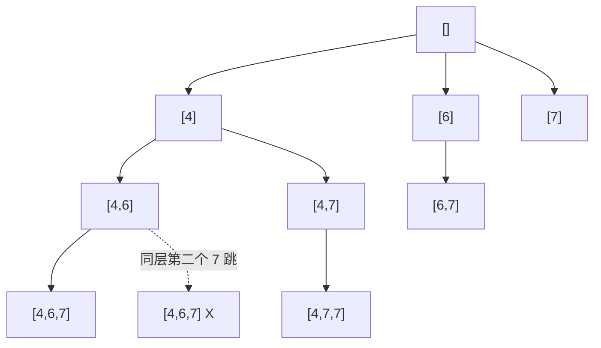

# 0491. Non-decreasing Subsequences / 递增子序列

!!! info "Meta"
    - **Difficulty**: Medium
    - **Tags**: Backtracking, Array, Hash Set · 回溯, 数组, 哈希集合
    - **Link**: [LeetCode](https://leetcode.com/problems/non-decreasing-subsequences/)
    - **Status**: ✅ Solved
    - **Reviewed**: ☐ ☐ ☐

## Problem

**EN**: Given an array `nums`, return **all** the different possible **non-decreasing subsequences** of length ≥ 2. The result must not contain duplicates.

**中文**: 给一个数组 `nums`, 返回所有长度 ≥ 2 的不同**非降子序列**. 结果不能有重复.

## 思路

### Core idea

子集骨架 (同 [0078](../0078-subsets/README.md)) + **两个过滤**:

1. `nums[i] < path.back()` → 跳 (破坏非降).
2. `used.count(nums[i])` → 跳 (本层已经选过这个值, 防同层重复).

**关键**: `used` 是**每层局部** `unordered_set`, 自动随函数返回销毁 — 不需要 erase.

> 收果实条件: `path.size() >= 2` (题目要求至少 2 个).

### Key Insights

1. **不能 sort: subsequence 保序 / Why the 0040/0090 trick fails**

    [0040](../0040-combination-sum-ii/README.md) / [0090](../0090-subsets-ii/README.md) 同层去重靠 `sort + nums[i] == nums[i-1]` (相同值排序后挨在一起). 这题输入是**subsequence**, 必须保留原顺序 — 一 sort 整个题目都变了 (任意子序列都成非降, 答案集合直接爆炸).

    所以 0040 的去重模板**不能直接搬**, 必须用**集合 (set)** 替代"相邻判同"的相邻假设.

2. **`unordered_set<int> used` 是每层局部变量 / Per-call set scoping**

    Yang 的注解抓得很准: `used` 写在函数入口, 每次递归进入新建, 函数返回时栈上销毁. 由此自动获得"同层去重"语义:

    - 同一层 (同一个调用栈帧) 的 for 循环共享一个 `used` — 检查"这层是不是已经用过这个值".
    - 下一层 (递归子调用) 进入新建独立的 `used` — 兄弟 path 不互相干扰.
    - 不需要写 `used.erase()` — 局部变量随函数返回自动清理.

    **如果**把 `used` 写成类成员/全局, 就要手动管理 (push 后 erase 之类), 代码长得多且容易错.

3. **三种同层去重姿势的对照表 / Three same-level dedup mechanisms**

    | 题 | 候选状况 | 去重机制 |
    |---|---|---|
    | [0090](../0090-subsets-ii/README.md) 子集 II | nums 有重 + **可 sort** | sort + `nums[i] == nums[i-1]` (相邻) |
    | [0040](../0040-combination-sum-ii/README.md) 组合和 II | nums 有重 + **可 sort** | sort + `nums[i] == nums[i-1]` |
    | **0491 (本题)** | nums 有重 + **不能 sort** | 每层 `unordered_set` (任意位置, 不依赖相邻) |
    | 0047 排列 II (待补) | nums 有重 + 可 sort | sort + `used[i-1] == false` (跨支版) |

    一句话: **能 sort 用相邻判, 不能 sort 用 set 判**.

4. **`path.size() >= 2` 才收 / Length filter on harvest**

    跟 [0078](../0078-subsets/README.md) "每个节点都收" 的区别只有一个判断. 函数入口先 push 后判 size — `[]` 和 `[1]` 不收, `[1, 2]` 起步才收.

5. **复杂度 O(n × 2^n) / Same upper bound as subsets**

    决策树规模没变 (n 个元素的子集). `unordered_set` 操作 O(1) 摊销, 不影响阶. 同层去重剪掉的子树越多, 实际越快.

### 一句话总结

**0078 子集模板 + 两个 continue (非降破坏 / 同层已用) + 函数入口局部 `unordered_set`. 不能 sort, 用 set 替代相邻去重.**

### 图解

`nums = [4, 6, 7, 7]` 的决策树 (起点 4):



第二个 7 在 startIndex=2 那层被 `used.count(7)` 拦掉; 但 `[4,7,7]` 仍然合法因为是不同**层**.

## Solution

=== "C++"
    ```cpp
    class Solution {
    public:
        vector<vector<int>> res;
        vector<int> path;
        void backtrack(vector<int>& nums, int start) {
            if (path.size() >= 2) res.push_back(path);          // 收果实: 长度 >= 2
            unordered_set<int> used;                            // 每层局部 set, 函数返回自动销毁
            for (int i = start; i < (int)nums.size(); i++) {
                if (!path.empty() && nums[i] < path.back()) continue;  // 非降破坏
                if (used.count(nums[i])) continue;              // 本层同值已用
                path.push_back(nums[i]);
                used.insert(nums[i]);                           // 标记本层用过 (不需 erase)
                backtrack(nums, i + 1);
                path.pop_back();
            }
        }
        vector<vector<int>> findSubsequences(vector<int>& nums) {
            backtrack(nums, 0);
            return res;
        }
    };
    ```

=== "Python"
    ```python
    class Solution:
        def findSubsequences(self, nums: list[int]) -> list[list[int]]:
            res, path = [], []
            def backtrack(start: int):
                if len(path) >= 2:
                    res.append(path[:])
                used = set()                                    # 每层局部 set, 退栈自动 gc
                for i in range(start, len(nums)):
                    if path and nums[i] < path[-1]:
                        continue
                    if nums[i] in used:                         # set 的 in 是 O(1) 平均, 等价 C++ unordered_set::count
                        continue
                    path.append(nums[i])
                    used.add(nums[i])
                    backtrack(i + 1)
                    path.pop()
            backtrack(0)
            return res
    ```

=== "JavaScript"
    ```javascript
    /**
     * @param {number[]} nums
     * @return {number[][]}
     */
    var findSubsequences = function(nums) {
        const res = [], path = [];
        const backtrack = (start) => {
            if (path.length >= 2) res.push([...path]);
            const used = new Set();                             // 每层局部 Set, 闭包不外泄
            for (let i = start; i < nums.length; i++) {
                if (path.length && nums[i] < path[path.length - 1]) continue;
                if (used.has(nums[i])) continue;                // Set.has 是 O(1) 平均, 等价 C++ unordered_set::count
                path.push(nums[i]);
                used.add(nums[i]);
                backtrack(i + 1);
                path.pop();
            }
        };
        backtrack(0);
        return res;
    };
    ```

## Complexity

- **Time**: O(n × 2^n) 上界 — 子集决策树 × 拷贝.
- **Space**: O(n) recursion + path + 每层一个 set (总 O(n²) 跨栈, 但单帧 O(n)).

## 易错点

- **不能 `sort(nums)`**: 这题保序是题目语义的一部分. 排序后任意子序列都成非降, 答案集合错爆.
- **`used` 必须是函数入口的局部变量**: 写成类成员/全局会跨层污染, 兄弟 path 互相抢标记. 局部变量是这题的灵魂 — Yang 自己标记的关键.

## 相关题目

- [0078. Subsets](../0078-subsets/README.md) — 子集基础, 本题去掉非降和去重就是它
- [0090. Subsets II](../0090-subsets-ii/README.md) — 可 sort 时的同层去重模板, 跟本题刚好对比
- [0040. Combination Sum II](../0040-combination-sum-ii/README.md) — 同款"可 sort 时的同层去重"
- 0046\. Permutations (待补) — 排列基础, 用 `used[]` 数组
- 0047\. Permutations II (待补) — 排列 + 同层去重 (sort + `used[i-1] == false`), 跟本题对比可 sort vs 不可 sort
- 0300\. Longest Increasing Subsequence (待补) — 同款保序约束, 但只求最长, DP 才合适不是回溯
