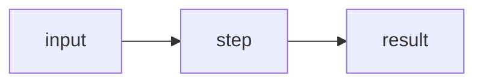

# NNNN. Title (English) / 中文标题

!!! info "Meta"
    - **Difficulty**: Easy/Medium/Hard
    - **Tags**: Array, Hash Table · 数组, 哈希表
    - **Link**: [LeetCode](https://leetcode.com/problems/...)
    - **Status**: ✅ Solved
    - **First solved**: YYYY-MM-DD
    - **Reviewed**: ☐ ☐ ☐

## Problem / 题意

**EN**: Paraphrase in my own words. Do NOT copy LeetCode's wording — link only.

**中文**: 用自己的话简述题意，不要复制原题面。

## Approach / 思路

### 核心思想 / Core idea

**EN**: One or two punch sentences — the "why this works", not the "what to do".

**中文**: 一两句话讲清楚为什么这样做.

### 关键洞察 / Key insights

1. **Insight name** — 1-3 sentence explanation of the non-obvious observation.
2. **Insight name** — ...
3. **Insight name** — ...

### 可迁移思路 / Transferable thinking

- **0XXX. Related Problem** — 一句话讲怎么把这个套路搬过去.
- **Pattern name** — generalization (e.g. prefix sum, monotonic stack, sliding window).

### 一句话总结 / One-liner

**EN**: The "if you only remember one thing" line.

### Visual / 图解



## Solution / 题解

=== "C++"
    ```cpp
    class Solution {
    public:
        ... method(...) {
            // Comment only on non-obvious algorithmic steps. Skip syntax narration.
            ...
        }
    };
    ```

=== "Python"
    ```python
    class Solution:
        def method(self, ...):
            # If this is a direct port of the C++ logic, keep comments minimal.
            # If it uses a Python-specific idiom (Counter, heapq, bisect, comprehension,
            # @lru_cache, slicing trick, etc.), explain:
            #   - what it does
            #   - why it fits here
            #   - rough C++ equivalent
            ...
    ```

=== "JavaScript"
    ```javascript
    /**
     * @param {...}
     * @return {...}
     */
    var method = function(...) {
        // If direct port of C++, keep comments minimal.
        // If using a JS idiom (Map/Set, spread, destructuring, Array.from, reduce,
        // optional chaining, BigInt, etc.), explain what + why + C++ equivalent.
        ...
    };
    ```

## Complexity / 复杂度

- **Time**: O(?)
- **Space**: O(?)

## Pitfalls / 易错点

- ...

## Related / 相关题目

- [NNNN. Title](../NNNN-slug/)
