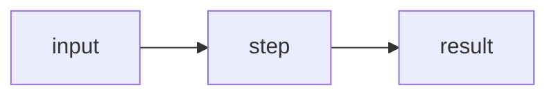

# NNNN. Title (English) / 中文标题

!!! info "Meta"
    - **Difficulty**: Easy/Medium/Hard
    - **Tags**: Array, Hash Table · 数组, 哈希表
    - **Link**: [LeetCode](https://leetcode.com/problems/...) · [力扣](https://leetcode.cn/problems/...)
    - **Status**: ✅ Solved
    - **First solved**: YYYY-MM-DD
    - **Reviewed**: ☐ ☐ ☐

## Problem / 题意

**EN**: Paraphrase in my own words. Do NOT copy LeetCode's wording — link only.

**中文**: 用自己的话简述题意，不要复制原题面。

## Approach / 思路

**EN**: Key insight, invariant, why this works.

**中文**: 关键思路、不变量、为什么可行。

### Visual / 图解



## Solution / 题解

=== "Python"
    ```python
    class Solution:
        def method(self, ...):
            ...
    ```

=== "C++"
    ```cpp
    class Solution {
    public:
        ... method(...) {
            ...
        }
    };
    ```

=== "Java"
    ```java
    class Solution {
        public ... method(...) {
            ...
        }
    }
    ```

## Complexity / 复杂度

- **Time**: O(?)
- **Space**: O(?)

## Pitfalls / 易错点

- ...

## Related / 相关题目

- [NNNN. Title](../NNNN-slug/)
